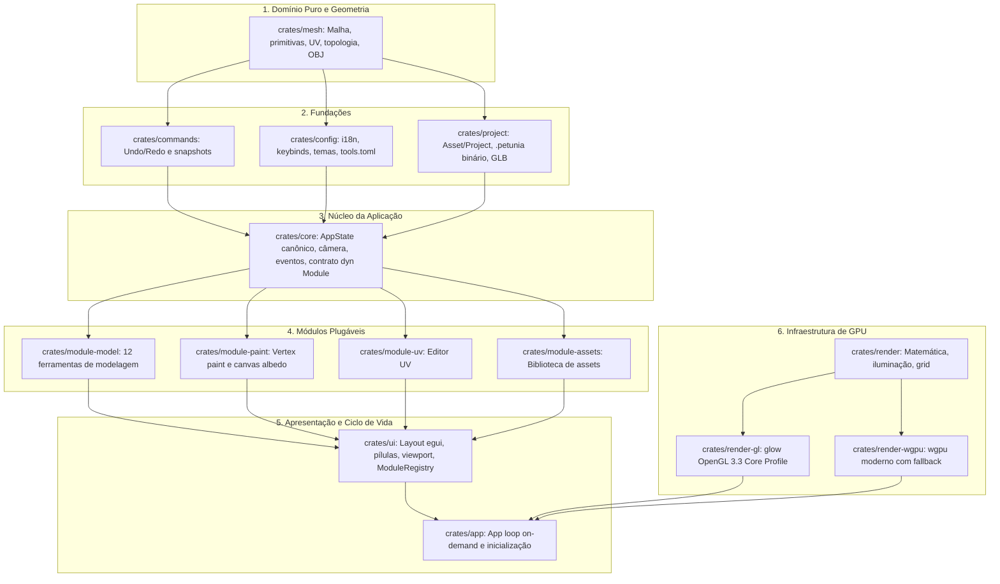

# Visão Geral de Arquitetura — Petunia3D

Topologia modular de crates em Rust, fronteiras de domínio, contratos de módulos e pipeline gráfico.

---

## 1. System Boundaries e Grafo Acíclico de Crates

O Petunia3D adota uma arquitetura em camadas concêntricas composta por **14 crates acíclicos** em Rust:

---

## 2. Major Components (Componentes Principais)

1. **`petunia_mesh`**: Malha indexada com vértices, arestas e faces poligonais. Operações geométricas determinísticas (extrude, inset, bevel, subdivide, merge) sem dependências gráficas ou de UI.
2. **`petunia_core`**: Define o `AppState`, que centraliza o estado de seleção, câmera 3D, referências ativas e histórico de eventos.
3. **`petunia_commands`**: Snapshots da malha empilhados em histórico de comandos. Permite `undo` e `redo` consistentes para todas as operações destrutivas.
4. **`petunia_project`**: Gerencia o documento canônico `.petunia` com UUIDs únicos por asset, serialização binária com verificação de bounds e exporters OBJ/GLB.
5. **`petunia_ui`**: Constrói a interface imediata (immediate mode) com `egui`, orquestrando painéis laterais e viewport através do `ModuleRegistry`.
6. **`petunia_render_gl` & `petunia_render_wgpu`**: Únicos componentes autorizados a emitir comandos para a GPU. Implementam shaders GLSL 330 com upload condicional de texturas via hash FNV-1a.

---

## 3. Dependency Direction (Direção das Dependências)

- **Regra Inviolável de Módulos**: Módulos funcionais (`module-model`, `module-paint`, etc.) conhecem `core`, mas nunca conhecem uns aos outros. Toda comunicação intermódulos ocorre através do barramento de eventos de `core` (`MeshChanged`, `SelectionChanged`, `ToolActivated`).
- **Isolamento de GPU**: O núcleo da aplicação desconhece OpenGL ou Vulkan. Apenas os crates `render-gl` e `render-wgpu` tocam as APIs gráficas do sistema.

---

## 4. Canonical State Ownership (Posse do Estado Canônico)

- **O que possui o estado canônico?**: Em tempo de execução, `core::AppState` possui o estado canônico volátil (malha ativa, seleção, câmera e configurações). Em disco, o arquivo de projeto `.petunia` encapsulado por `project::Project` detém o estado persistente.
- **Quem pode mutá-lo?**: Módulos ativos exclusivamente através da submissão de comandos em `commands::CommandHistory` ou via dispatch formal no loop de eventos do `AppState`.

---

## 5. Render-on-Demand Loop

Diferente de engines de jogos convencionais que renderizam continuamente a 60/144 FPS mesmo sem interação:
- Petunia3D utiliza `ControlFlow::Wait` combinado com flag de dirty tracking.
- Redesenhos ocorrem apenas mediante eventos de entrada (movimento de mouse, cliques, teclas), animação ativa ou mutação de malha.
- **Estado ocioso (idle)**: Consumo de **0 frames por segundo** e uso desprezível de CPU/GPU.
