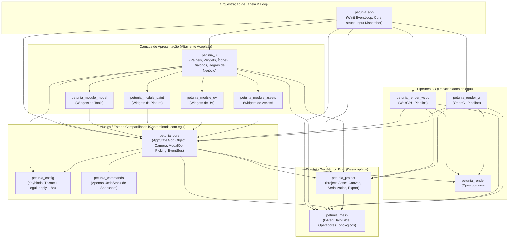

# 01 — Arquitetura Atual do Código Real

> **Evidência física dos crates, camadas funcionais reais e fluxos de execução do Petunia3D.**

---

## 1. Estrutura Física do Workspace

O projeto é estruturado em um Cargo Workspace composto por **15 crates** e um binário principal:

```text
simple3d-modeling/
├── Cargo.toml (workspace raiz)
├── src/
│   └── main.rs (binário petunia3d — ponto de entrada mínimo)
├── crates/
│   ├── app/ (petunia_app — inicialização winit, loop de eventos, render-on-demand)
│   ├── commands/ (petunia_commands — UndoStack genérica)
│   ├── config/ (petunia_config — temas, atalhos TOML, i18n, tools.toml)
│   ├── core/ (petunia_core — AppState, picking, câmera, eventos, modal)
│   ├── mesh/ (petunia_mesh — estrutura B-Rep/half-edge, operadores topológicos)
│   ├── module-assets/ (petunia_module_assets — painel de assets)
│   ├── module-model/ (petunia_module_model — catálogo e UI de ferramentas)
│   ├── module-paint/ (petunia_module_paint — pintura de vértices e canvas)
│   ├── module-uv/ (petunia_module_uv — projeção UV e editor planar)
│   ├── project/ (petunia_project — Project, Asset, serialização postcard, exportação)
│   ├── render/ (petunia_render — tipos comuns: Shading, GpuCaps, FrameStats)
│   ├── render-gl/ (petunia_render_gl — pipeline OpenGL via glow)
│   ├── render-wgpu/ (petunia_render_wgpu — pipeline WebGPU via wgpu)
│   ├── ui/ (petunia_ui — painéis egui, ícones vetoriais, outliner, viewport)
│   └── xtask/ (xtask — automação de documentação e validações)
```

---

## 2. Inventário e Responsabilidades Reais dos Crates

| Crate | Responsabilidade Real no Código | Dependências Externas Chave | Linhas de Código (Aprox) |
| :--- | :--- | :--- | :---: |
| **`petunia_mesh`** | Núcleo geométrico puro: malha, half-edge, extrusão, chanfro, corte, faca, subdivisão, triangulação, OBJ. | `glam`, `serde`, `thiserror` | ~4.200 |
| **`petunia_project`**| Estrutura de dados persistente do projeto (`Project`, `Asset`, `Canvas`, anotações, medições, exportadores OBJ/glTF, serializer postcard). | `petunia_mesh`, `uuid`, `postcard`, `bytemuck`, `glam` | ~1.600 |
| **`petunia_commands`**| Apenas um buffer de histórico `UndoStack<T: Clone>` com capacidade para 100 snapshots. **Não possui comandos semânticos.** | *(nenhuma)* | ~100 |
| **`petunia_config`** | Carregador de temas TOML, dicionários de atalhos, tradutor i18n. Aplica estilos diretamente ao `egui::Context`. | `egui`, `serde`, `toml` | ~1.500 |
| **`petunia_core`** | **God State**: centraliza `AppState`, picking 3D em tela, matemática de câmera, operações modais de transformação e `EventBus`. | `egui`, `petunia_mesh`, `petunia_project`, `petunia_config`, `petunia_render`, `glam`, `uuid` | ~2.800 |
| **`petunia_render`** | Enums neutros de sombreamento (`Shading`) e estatísticas (`FrameStats`, `GpuCaps`). | *(nenhuma)* | ~50 |
| **`petunia_render_wgpu`**| Pipeline WebGPU de malha, grid e referências. Totalmente desacoplado de egui. | `wgpu`, `bytemuck`, `glam`, `petunia_core`, `petunia_mesh` | ~950 |
| **`petunia_render_gl`**| Pipeline OpenGL legado usando `glow` e shaders GLSL. | `glow`, `egui_glow`, `glutin`, `glam`, `petunia_core` | ~1.100 |
| **`petunia_module_model`**| Catálogo de ferramentas poligonais. Mistura declaração de metadados com widgets de propriedades em egui. | `egui`, `petunia_core`, `petunia_mesh`, `petunia_config` | ~1.200 |
| **`petunia_module_paint`**| Ferramenta de pintura de vértices e canvas de textura. Contém widgets egui e abre diálogos de arquivos via `rfd`. | `egui`, `rfd`, `petunia_core`, `petunia_project` | ~500 |
| **`petunia_module_uv`** | Editor planar e unwrapping UV. Contém widgets egui de desenho vetorial da malha UV. | `egui`, `petunia_core`, `petunia_mesh` | ~400 |
| **`petunia_module_assets`**| Painel de listagem de assets do projeto com widgets egui. | `egui`, `petunia_core`, `petunia_mesh` | ~300 |
| **`petunia_ui`** | Apresentação completa: Outliner, Properties, Toolbar, Viewport Bar, Contextual Shelf, Ícones, Diálogos de Sistema. Contém centenas de regras de negócio. | `egui`, `egui-file-dialog`, `egui_tiles`, `egui_ltreeview`, `transform-gizmo-egui`, `rfd`, `image` | ~9.800 |
| **`petunia_app`** | Orquestrador da aplicação desktop: gerencia a janela winit, superfícies de renderização, ciclo de vida e ponte entre egui e GPU. | `winit`, `egui-winit`, `egui-wgpu`, `egui_glow`, `pollster`, `image` | ~1.850 |
| **`petunia3d`** | Binário de inicialização: configura `env_logger` e chama `petunia_app::run()`. | `petunia_app`, `env_logger` | ~15 |

---

## 3. Diagrama da Arquitetura Atual Real

O diagrama abaixo reflete a **realidade física do código**, e não o modelo idealizado da documentação:



---

## 4. Fluxos de Execução do Runtime

### 4.1. Inicialização (App Startup)
1. `src/main.rs` configura o logger e invoca `petunia_app::run()`.
2. `petunia_app` cria o `winit::event_loop::EventLoop`.
3. No evento `resumed`, `petunia_app` cria a janela `winit::window::Window`.
4. Inicializa o backend gráfico primário (WebGPU com fallback para OpenGL glow).
5. Cria a struct `Core` (definida em `petunia_app`), instanciando `AppState::new(lang)`, que inicializa a `Project` default (com um cubo 3D) e a `UndoStack<Project>`.
6. Registra os módulos concretos (`PaintModule`, `UvModule`, `AssetsModule`) no `ModuleRegistry`.
7. Inicializa o contexto `egui::Context` e aplica o tema ativo através de `Theme::apply(ctx)`.

### 4.2. Ciclo de Vida do Frame (Update & Render Loop)
1. O winit dispara o evento `RedrawRequested`.
2. `Core::dispatch_events(&mut self)` drena a fila `EventBus` e notifica os módulos registrados.
3. `egui-winit` captura eventos de mouse, teclado e toque e inicia o frame `ctx.begin_pass()`.
4. `petunia_ui::draw(ctx, &mut state, &tools, &modules)` executa a interface completa:
   - Header superior, Viewport Bar, Outliner, Properties, Shelf, Drawer.
   - O viewport egui reserva um retângulo central (`viewport_rect`).
   - Se houver sessão modal ou de corte (`cutting.rs`, `modal_viewport.rs`), ela intercepta os cliques e o teclado do frame.
5. O `egui` finaliza o frame (`ctx.end_pass()`), gerando uma lista de vértices e comandos 2D (`paint_jobs`).
6. **Passo 1 de Renderização**: O pipeline 3D (`petunia_render_wgpu` ou `petunia_render_gl`) renderiza a malha, grid e eixos diretamente no framebuffer ou textura do viewport.
7. **Passo 2 de Renderização**: O renderer do egui (`egui-wgpu` ou `egui_glow`) renderiza a UI por cima da cena 3D.
8. Apresenta o frame na tela (`window.pre_present_notify()` e `surface.present()`).

### 4.3. Despacho de Input e Atalhos
* Atalhos globais são interceptados primeiro em `petunia_app::Core::on_key(physical_key)`.
* `Core::on_key` consulta `Keybinds::find()` para obter uma string de ação (ex: `"model.extrude"`).
* Se a string casar com uma ação conhecida, muta campos diretamente em `AppState` (ex: `state.active_tool = "extrude".into()`).
* Se uma sessão modal estiver ativa (`state.is_interacting()`), o teclado winit é ignorado e o input é consumido pelo widget `modal_viewport.rs` dentro do loop do egui.
