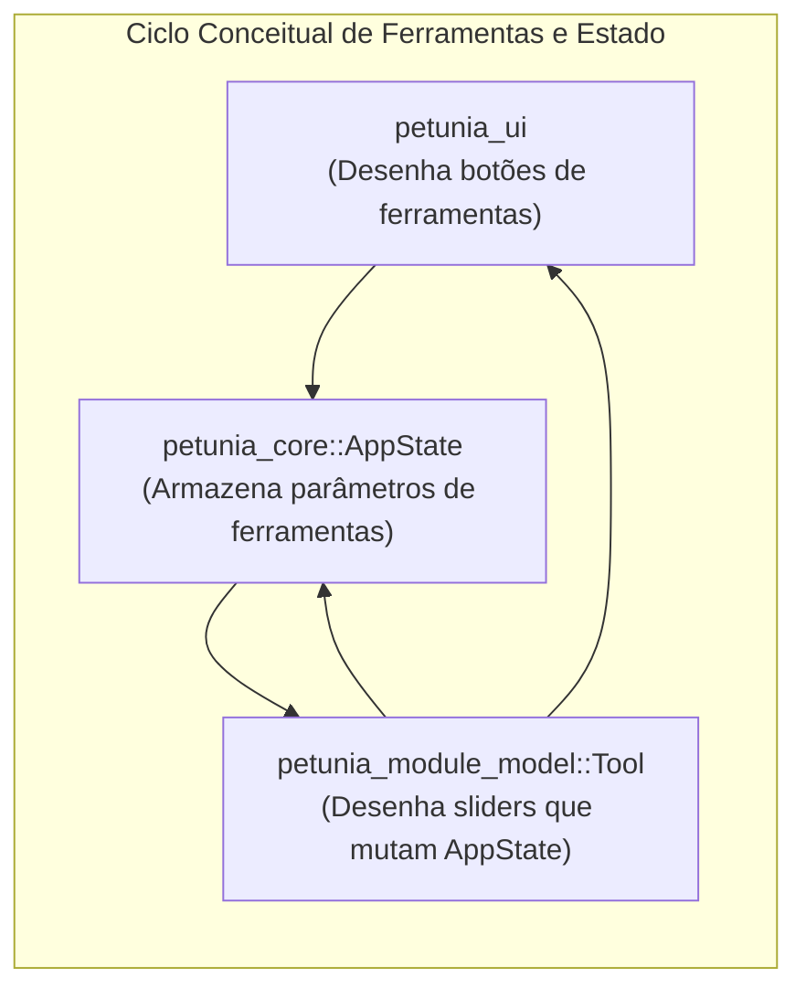

# 02 — Análise de Dependências e Grafo Real

> **Mapeamento exaustivo das relações entre crates, classificação de acoplamentos e detecção de violações de direção arquitetural.**

---

## 1. Matriz de Dependências entre Crates

A tabela abaixo cruza todos os crates do workspace, mapeando as dependências declaradas em seus respectivos arquivos `Cargo.toml`:

| De (Origem) \ Para (Destino) | `mesh` | `project` | `commands` | `config` | `core` | `render` | `render-wgpu` | `render-gl` | `module-*` | `ui` | `app` | `egui` |
| :--- | :---: | :---: | :---: | :---: | :---: | :---: | :---: | :---: | :---: | :---: | :---: | :---: |
| **`petunia_mesh`** | — | | | | | | | | | | | |
| **`petunia_project`** | **X** | — | | | | | | | | | | |
| **`petunia_commands`** | | | — | | | | | | | | | |
| **`petunia_config`** | | | | — | | | | | | | | **X** |
| **`petunia_core`** | **X** | **X** | **X** | **X** | — | **X** | | | | | | **X** |
| **`petunia_render`** | | | | | | — | | | | | | |
| **`petunia_render_wgpu`**| **X** | **X** | | | **X** | **X** | — | | | | | |
| **`petunia_render_gl`** | **X** | **X** | | | **X** | **X** | | — | | | | **X** |
| **`petunia_module_model`**| **X** | | | **X** | **X** | | | | — | | | **X** |
| **`petunia_module_paint`**| **X** | **X** | | | **X** | | | | — | | | **X** |
| **`petunia_module_uv`** | **X** | | | | **X** | | | | — | | | **X** |
| **`petunia_module_assets`**| **X** | | | | **X** | | | | — | | | **X** |
| **`petunia_ui`** | **X** | **X** | | **X** | **X** | **X** | | | **X** | — | | **X** |
| **`petunia_app`** | **X** | **X** | | **X** | **X** | **X** | **X** | **X** | **X** | **X** | — | **X** |

---

## 2. Classificação Sistemática das Dependências

As dependências foram auditadas segundo a taxonomia estrita exigida pela auditoria:

### 2.1. `EXPECTED` (Esperadas e Corretas)
* `petunia_project -> petunia_mesh`: O projeto armazena malhas em seus assets.
* `petunia_render_wgpu -> petunia_mesh`: O pipeline precisa ler vértices e normais para enviar aos buffers da GPU.
* `petunia_render_wgpu -> petunia_project`: Para renderizar a coleção de assets da cena e quads de referência.
* `petunia_ui -> petunia_core`: A interface gráfica consome o estado do editor e emite comandos.
* `petunia_app -> petunia_ui`: A aplicação de topo orquestra a interface gráfica.

### 2.2. `WRONG-DIRECTION` (Inversão de Dependência Violada)
* **`petunia_core -> egui` (GRAVÍSSIMO)**:
  * O núcleo da aplicação depende diretamente da biblioteca de interface gráfica `egui`.
  * Evidência: `crates/core/Cargo.toml` linha 13 (`egui = { workspace = true }`).
  * Evidência: `crates/core/src/state.rs` linha 189 (`pub viewport_rect: Option<egui::Rect>`) e linha 202 (`pub canvas_tex: Option<egui::TextureHandle>`).
  * Evidência: `crates/core/src/module.rs` linha 10 (`fn ui(&mut self, _ctx: &egui::Context, _ui: &mut egui::Ui, ...)`).
* **`petunia_config -> egui`**:
  * Um crate de configuração e internacionalização depende da biblioteca de widgets para aplicar temas.
  * Evidência: `crates/config/Cargo.toml` linha 10 (`egui = { workspace = true }`).
  * Evidência: `crates/config/src/theme.rs` linha 221 (`pub fn apply(&self, ctx: &egui::Context)`).

### 2.3. `QUESTIONABLE` (Questionáveis / Acoplamento por Conveniência)
* **`petunia_module_* -> egui`**:
  * Os crates de módulo (`module-model`, `module-paint`, `module-uv`, `module-assets`) contêm algoritmos de modelagem e edição de dados, mas carregam dependência direta de `egui` porque a trait `Module` e a trait `Tool` exigem métodos `ui(...)`.
  * Isto impede o reuso das regras de negócio desses módulos em qualquer frontend sem egui.
* **`petunia_render_wgpu -> petunia_core`**:
  * O renderer 3D depende do `petunia_core` primariamente para importar a struct `Camera` e `ReferenceImage`.
  * Idealmente, tipos matemáticos de câmera pertenceriam a uma camada pura ou seriam passados como matrizes uniformes neutras.

### 2.4. `UI-LEAK` (Vazamento de Tipos de Interface)
* `egui::Rect` em `petunia_core::viewport::PhysicalViewport::from_logical(rect: Option<egui::Rect>)`.
* `egui::TextureHandle` em `petunia_core::state::ReferenceImage::texture` e `AppState::canvas_tex`.
* `egui::Context` e `egui::Ui` nas assinaturas das traits centrais `Module` (`crates/core/src/module.rs`) e `Tool` (`crates/module-model/src/lib.rs`).

### 2.5. `INFRASTRUCTURE-LEAK` (Vazamento de Infraestrutura/OS)
* Uso direto da biblioteca de diálogos do sistema operacional (`rfd::FileDialog`) dentro de `crates/ui/src/lib.rs` (linhas 125, 153, 170, 243, 436, 449, 647) e dentro de `crates/module-paint/src/lib.rs` (linhas 65, 89).
* O núcleo ou os módulos não possuem portas de abstração para operações de I/O de arquivos.

### 2.6. `GLOBAL-STATE` (Estado Global Compartilhado)
* **Avaliação Positiva**: Não existem `static mut`, `OnceLock`, `thread_local!` ou `Arc<Mutex<AppState>>` compartilhados entre crates.
* A única variável estática identificada no workspace é `TEXTURE_CACHE: LazyLock<RwLock<HashMap<String, TextureHandle>>>` em `crates/ui/src/icon_registry.rs`, estritamente confinada ao cache de texturas do egui na camada de apresentação.

---

## 3. Análise de Ciclos Conceituais

Embora o Cargo impeça ciclos diretos de compilação entre crates, existem **ciclos conceituais de alto acoplamento bidirecional**:

### Explicação do Ciclo:
1. `petunia_ui` desenha a barra de ferramentas e seleciona a ferramenta ativa escrevendo em `state.active_tool` (string).
2. `petunia_ui` invoca o método `tool.ui(ctx, ui, state)` da ferramenta registrada em `petunia_module_model`.
3. O método `tool.ui` desenha widgets egui que **modificam diretamente** campos específicos de `state` (como `state.extrude_dist` ou `state.inset_factor`).
4. Ao clicar no botão da ferramenta, `tool.ui` chama `state.checkpoint()`, altera a malha em `state.project`, e dispara `state.emit_mesh_changed()`, forçando a `petunia_ui` a se redesenhar no frame seguinte.
5. A ferramenta não pode ser testada nem executada sem a presença simultânea do `egui::Context`, do `egui::Ui` e do `AppState`.
