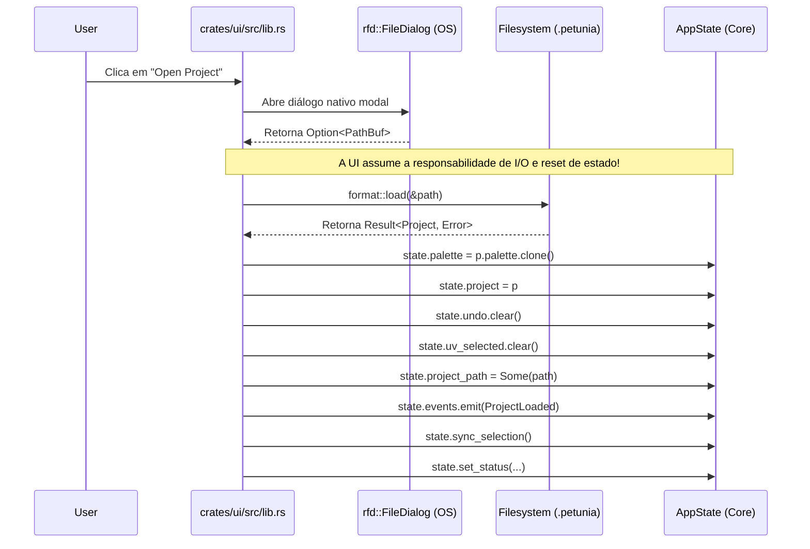

# 08 — Sistema de Projetos, Assets e I/O (Project, Assets & I/O Boundary)

> **Auditoria da persistência de projetos, formato de arquivo, gerenciamento de assets e invasão de I/O na camada de interface.**

---

## 1. Avaliação do Crate `petunia_project`

O crate `petunia_project` é outro **ponto positivo e arquiteturalmente limpo** do ecossistema:
* Contém a estrutura de dados persistente `Project`, que engloba assets com UUIDs estáveis (`Uuid::new_v4()`), malhas associadas, anotações vetoriais, réguas métricas e paleta de cores.
* Serialização determinística e compacta através do formato binário `postcard` (`format::save` e `format::load`).
* Exportadores nativos puros para arquivos Wavefront OBJ (`export::export_obj`) e glTF/GLB binário (`export::export_gltf`).
* **Zero dependências de egui:** O crate depende apenas de `petunia_mesh`, `serde`, `postcard`, `uuid`, `bytemuck` e `glam`.

---

## 2. O Problema da Fronteira de I/O: Diálogos e Mutação na UI

Apesar de o crate `petunia_project` ser limpo, as **operações de ciclo de vida de projeto foram implementadas dentro da UI**:

### Violações Identificadas:
1. **Ausência de Serviço de Aplicação**:
   * Não existe uma função `ProjectService::load_project(&mut session, path)` ou `App::open_file(path)`.
   * Se um teste automatizado, uma interface alternativa em Qt ou uma CLI quiser abrir um projeto, ela terá que copiar e colar as 15 linhas de reset de estado que hoje vivem em `crates/ui/src/lib.rs`.
2. **Uso de Diálogos Nativos em Módulos**:
   * O módulo `petunia_module_paint` invoca diretamente `rfd::FileDialog::new()` em `crates/module-paint/src/lib.rs` (linhas 65 e 89) para carregar imagens de textura, violando a regra de que o domínio e os módulos não devem conhecer o sistema de janelas do SO.
3. **Decisões de Apresentação em Erros de I/O**:
   * Ao falhar um salvamento, a UI executa `state.set_status(format!("save err: {e}"))`, escrevendo uma string formatada em inglês/código diretamente no status do editor, em vez de gerar um evento estruturado de erro para a camada de notificações.

---

## 3. Sistema de Assets vs Navegador de Assets (Asset Browser)

### O que existe hoje no Domínio:
* Os modelos são mantidos na coleção `project.assets: Vec<Asset>`.
* Cada asset possui um UUID v4 permanente, nome, malha, cor base, textura de albedo e flag de visibilidade/bloqueio.
* Métodos no `AppState`: `save_active_as_asset()` (salva o modelo ativo na biblioteca interna) e `instantiate_asset_at_cursor()` (cria uma instância do asset na posição do cursor 3D).

### O que existe hoje na UI:
* Dois componentes visuais distintos:
  * `crates/ui/src/asset_browser.rs`: Painel retrátil à esquerda (gaveta rápida de navegação);
  * `crates/ui/src/asset_library_drawer.rs`: Modal central detalhado com busca, cartões e estatísticas de vértices/faces.

### Lacuna Arquitetural Identificada:
* **Geração de Miniaturas (Thumbnails)**: O sistema de assets não possui pipeline de geração de miniaturas 3D offscreen. Os cartões de asset exibem apenas um chip quadrado da cor base do material e a contagem de polígonos. A futura introdução de thumbnails pré-renderizados exigirá que o renderer produza imagens offscreen para o subsistema de assets de forma completamente independente de widgets egui.
