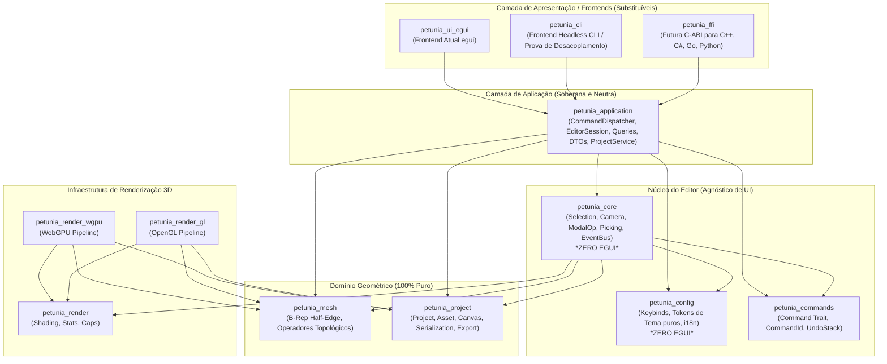

# 15 — Alternativas de Arquitetura-Alvo (Target Architecture Options)

> **Comparativo estruturado de alternativas arquiteturais, análise de prós e contras e recomendação pragmática para o Petunia3D.**

---

## 1. Comparativo de Três Estratégias de Arquitetura

Para orientar a evolução do projeto sem incorrer em dogmatismo ("Clean Architecture religiosa"), foram avaliadas três alternativas técnicas viáveis:

```text
┌─────────────────────────────────────────────────────────────────────────────────┐
│                     OPÇÃO A: Módulo Único / Crates Consolidados                 │
│  Reduzir crates; usar visibilidade Rust (pub(crate)) e módulos internos estritos. │
├─────────────────────────────────────────────────────────────────────────────────┤
│                     OPÇÃO B: Crates Estratificados Pragmáticos (Recomendada)    │
│  Manter limites físicos onde o compilador proíbe imports proibidos (Core -> UI).│
├─────────────────────────────────────────────────────────────────────────────────┤
│                     OPÇÃO C: DDD / Clean Architecture Corporativa Pesada        │
│  Interfaces para cada struct, DTOs intermediários em cada camada, Repositories. │
└─────────────────────────────────────────────────────────────────────────────────┘
```

| Critério Técnico | Opção A: Consolidação em Poucos Crates | Opção B: Crates Estratificados Pragmáticos | Opção C: DDD / Clean Architecture Pesada |
| :--- | :--- | :--- | :--- |
| **Garantia de Não-Regressão** | **Baixa**: Fácil reintroduzir `use egui` acidentalmente em submódulos | **Máxima**: Compilador bloqueia fisicamente dependências proibidas | **Alta**: Camadas abstratas bloqueiam vazamentos |
| **Desempenho em Tempo de Execução** | **Zero-Cost**: Chamadas diretas sem dynamic dispatch | **Zero-Cost**: Traits estáticas e chamadas diretas | **Penalidade**: Múltiplas alocações e cópias de DTOs |
| **Tempo de Compilação (Build)** | Médio (recompilação de crate maior a cada alteração) | **Rápido**: Crates de domínio (`mesh`, `project`) raramente recompilam | Lento (muitas macros e abstrações) |
| **Ergonomia Idiomática Rust** | Alta | **Altíssima** | Baixa (parece Java/C# transposto para Rust) |
| **Complexidade de Migração** | Alta (fundir arquivos e reorganizar) | **Gradual (Strangler)**: Extração incremental passo a passo | Altíssima (reescrita quase total) |

---

## 2. Recomendação Pragmática: Opção B (Estratificação Limpa)

A **Opção B** é a escolha recomendada porque aproveita a divisão de crates que o Petunia3D já possui, corrigindo apenas a direção das dependências e estabelecendo a camada de aplicação que hoje está ausente:



---

## 3. Benefícios Estratégicos da Arquitetura Proposta

1. **Compilação do Core 100% Livre de UI**:
   * `petunia_core` passa a ter como dependências apenas `glam`, `serde`, `uuid` e os crates de domínio (`mesh`, `project`, `commands`, `config`).
   * Um teste unitário ou script de automação pode instanciar uma sessão completa e operar sobre a geometria em microssegundos.
2. **Fronteira Única de Entrada de Mutações**:
   * Toda e qualquer alteração de estado entra por `dispatcher.dispatch(Command)`, garantindo que o histórico de undo/redo, o dirty flag da GPU e os eventos de notificação sejam disparados de forma determinística e consistente.
3. **Substituição Trivial de Frontend**:
   * Construir uma nova UI em `Slint`, `Iced` ou `Qt` exigirá apenas conectar os widgets aos comandos e queries expostos por `petunia_application`, sem necessidade de conhecer a matemática interna de malha ou loops de modal.
