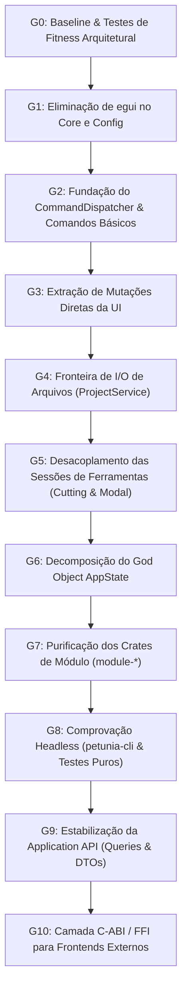

# 16 — Plano Diretor de Correção (Remediation Plan & Gauntlet Loop)

> **Roteiro estruturado em 11 ciclos incrementais (Gauntlet G0 a G10) para desacoplar a arquitetura do Petunia3D sem quebrar funcionalidades nem comprometer o desempenho.**
>
> ⚠️ **IMPORTANTE: ESTE PLANO NÃO DEVE SER EXECUTADO AGORA. TRATA-SE DE UM DOCUMENTO DE PLANEJAMENTO PARA REVISÃO E APROVAÇÃO PRÉVIA.**

---

## 1. Visão Geral e Estratégia de Migração (Strangler Fig)

Para mitigar qualquer risco de regressão em um aplicativo que já possui 198 testes automatizados aprovados, a refatoração deve seguir a **Estratégia Strangler**:
1. Criar novas fronteiras e contratos limpos paralelamente aos caminhos legados;
2. Migrar operações uma a uma através dos novos comandos semânticos;
3. Validar a paridade funcional e visual através da suíte de testes de UI do kittest;
4. Eliminar as dependências antigas e proibir reintroduções via testes de fitness automatizados;
5. **Preservar sempre o software compilando e funcionando a cada commit.**

---

## 2. Mapa do Caminho Crítico (Critical Path)

---

## 3. Detalhamento dos Ciclos do Gauntlet Loop

---

### Gauntlet G0 — Baseline e Testes de Fitness Arquitetural
* **Objetivo**: Congelar o comportamento funcional atual e criar scripts automatizados de verificação que impeçam a introdução de novos acoplamentos.
* **Achados Alvo**: Prevenção geral de regressões.
* **Arquivos Afetados**: `crates/xtask/src/main.rs`, novo teste em `crates/core/tests/architecture_fitness.rs`.
* **Passos de Implementação**:
  1. Adicionar comando `cargo xtask arch-check` que execute inspeções estáticas de dependência via `cargo tree` e `cargo metadata`;
  2. Registrar o baseline de desempenho e tempo de inicialização atual.
* **Critério de Saída (Exit Criteria)**:
  * `cargo xtask arch-check` executa e reporta com precisão o estado atual das dependências proibidas.

---

### Gauntlet G1 — Eliminação do `egui` no Núcleo (`petunia_core` e `petunia_config`)
* **Objetivo**: Fazer com que `petunia_core` e `petunia_config` compilem **zero referências ao egui**.
* **Achados Alvo**: **F-001**, **F-007**, **F-012**.
* **Pré-condições**: Ciclo G0 aprovado.
* **Arquivos Afetados**:
  * `crates/core/Cargo.toml`: Remover `egui = { workspace = true }`.
  * `crates/core/src/state.rs`: Mover `Option<egui::TextureHandle>` e `Option<egui::Rect>` para o frontend ou substituir por `[f32; 4]`.
  * `crates/core/src/viewport.rs`: Converter `PhysicalViewport::from_logical` para receber `Option<[f32; 4]>` ou `LogicalRect`.
  * `crates/core/src/module.rs`: Mover método `ui()` para uma trait de apresentação externa (`EditorModuleUi`).
  * `crates/config/Cargo.toml`: Remover `egui = { workspace = true }`.
  * `crates/config/src/theme.rs`: Mover `pub fn apply(&self, ctx: &egui::Context)` para `crates/ui/src/theme_adapter.rs`.
* **Testes de Segurança**:
  * `cargo check -p petunia_core` e `cargo check -p petunia_config` compilam sem egui.
  * Teste de fitness `core_must_never_depend_on_egui` passa a ser verde.
* **Critério de Saída**:
  * `petunia_core` e `petunia_config` não possuem `egui` em sua árvore de dependências. A interface do editor continua funcionando de forma idêntica.

---

### Gauntlet G2 — Fundação do Sistema de Comandos e Dispatcher [CONCLUÍDO]
* **Objetivo**: Introduzir comandos semânticos com payload tipado e um despachante central que automatize a gravação de checkpoints de histórico.
* **Achados Alvo**: **F-003**.
* **Status**: ✅ **CONCLUÍDO** (Implementado `Command`, `CommandDispatcher`, `CommandError`, 8 comandos canônicos e suíte de 7 testes de integração headless em `crates/core/tests/command_tests.rs`).
* **Pré-condições**: Ciclo G1 aprovado.
* **Arquivos Afetados**:
  * `crates/commands/src/lib.rs`: Trait genérica `Command<Context, Res, Err>` com suporte a Undo/Redo e labels semânticos.
  * `crates/core/src/command.rs`: Tipagem de erro `CommandError`, `CommandDispatcher` com registry e dispatch transacional, e 8 comandos canônicos (`AddPrimitiveCmd`, `DuplicateAssetCmd`, `DeleteAssetCmd`, `DeleteSelectionCmd`, `DuplicateSelectionCmd`, `SelectAllCmd`, `ClearSelectionCmd`, `InvertSelectionCmd`).
  * `crates/core/src/state.rs`: Integração `AppState::dispatch(&mut self, cmd: &dyn Command)`.
  * `crates/core/tests/command_tests.rs`: 7 testes de integração headless cobrindo roundtrips de Undo/Redo e sessão de modelagem completa.
* **Testes de Segurança**:
  * `cargo test -p petunia_commands`: 3 testes unitários aprovados.
  * `cargo test -p petunia_core`: 49 testes aprovados (42 unitários + 7 integração headless).
  * `cargo test --workspace`: todos os 214+ testes da workspace aprovados.
* **Critério de Saída**:
  * Comandos executam e desfazem transacionalmente com 100% de confiabilidade sem qualquer dependência de UI. Validado com sucesso.

---

### Gauntlet G3 — Extração de Mutações Diretas da Camada UI [CONCLUÍDO]
* **Objetivo**: Substituir todas as mutações topológicas ad-hoc em painéis de interface pelo despacho de comandos.
* **Achados Alvo**: **F-004**, **F-013**.
* **Status**: ✅ **CONCLUÍDO** (Mutações ad-hoc e checkpoints manuais de mesh e assets eliminados da UI; despachos via `state.dispatch(&Command)` integrados em todos os painéis e atalhos).
* **Pré-condições**: Ciclo G2 aprovado.
* **Arquivos Afetados**:
  * `crates/core/src/command.rs`: Novos comandos canônicos `SubdivideSelectionCmd`, `MergeCenterCmd`, `FlipNormalsCmd`.
  * `crates/ui/src/properties_panel.rs`: Substituição de mutações manuais por `DuplicateSelectionCmd` e `DeleteSelectionCmd`.
  * `crates/ui/src/outliner.rs`: Eliminação de manipulações manuais em favor de `DeleteAssetCmd`, `DuplicateAssetCmd` e `AddPrimitiveCmd`.
  * `crates/ui/src/viewport_bar.rs`: Menus `Select ▾`, `Add ▾`, `Object ▾` e `Mesh ▾` migrados para despachar comandos.
  * `crates/ui/src/contextual_shelf.rs`: Ações de duplicar, subdividir e merge migradas para comandos.
  * `crates/ui/src/nav_gizmo.rs`: Menu contextual (subdivide, flip normals, duplicate) migrado para comandos.
  * `crates/ui/src/asset_browser.rs` & `crates/ui/src/asset_library_drawer.rs`: Ações de duplicar e excluir assets migradas para comandos.
  * `crates/module-model/src/select.rs`: Ações de seleção migradas para comandos.
  * `crates/app/src/lib.rs`: Conexão dos atalhos `model.delete`, `model.duplicate`, `model.select_all`, `model.deselect_all`, `model.invert_selection` em `Core::on_key` diretamente ao dispatcher.
* **Testes de Segurança**:
  * Todos os 88 testes em `petunia_ui` (incluindo os 5 fluxos `egui_kittest`) aprovados com 100% de sucesso.
  * Todos os testes de `petunia_app`, `petunia_core`, `petunia_module_model` aprovados.
  * Suíte global com 215 testes aprovados.
* **Critério de Saída**:
  * A UI deixa de invocar `state.checkpoint()` e manipular malhas ad-hoc; todas as operações fluem pelo despachante transacional. Validado com sucesso.

---

### Gauntlet G4 — Fronteira de I/O de Arquivos (`ProjectService`) [CONCLUÍDO]
* **Objetivo**: Isolar todas as operações de leitura/gravação de disco em serviços puros de aplicação, removendo o acoplamento de file pickers do domínio.
* **Achados Alvo**: **F-009**.
* **Status**: ✅ **CONCLUÍDO** (`ProjectService` puro implementado em `crates/core/src/project_service.rs`; `rfd` removido de `petunia_module_paint`; `crates/ui/src/file_dialog_service.rs` centraliza 100% dos file dialogs nativos/in-canvas).
* **Pré-condições**: Ciclo G3 aprovado.
* **Arquivos Afetados**:
  * `crates/core/src/project_service.rs`: Serviço puro com `new_project`, `load_project`, `save_project`, `import_obj`, `export_obj`, `export_glb`, `export_all_obj_to_dir`, `import_palette`, `export_palette`, `add_reference_image` e `sanitize_filename`.
  * `crates/core/src/events.rs`: Adicionados eventos `RequestImportPalette` e `RequestExportPalette`.
  * `crates/core/tests/project_service_tests.rs`: 9 testes de integração e persistência headless.
  * `crates/module-paint/Cargo.toml` & `crates/module-paint/src/lib.rs`: Dependência e chamadas a `rfd` removidas; botões de paleta agora emitem eventos `AppEvent`.
  * `crates/ui/src/file_dialog_service.rs`: Centralização de todas as instanciações de `rfd::FileDialog` e `egui-file-dialog` com delegação ao `ProjectService`.
  * `crates/ui/src/lib.rs`: Redução de `open_project_dialog`, `save_project_dialog`, `import_obj_dialog`, `export_dialog`, `refs_section` e `pick_and_add_reference_image` para chamadas a `file_dialog_service` e `ProjectService`. Removidas dependências de `petunia_mesh::Mesh` e `petunia_project::format` do root de UI.
  * `crates/app/src/lib.rs`: Tratamento de `RequestImportPalette` e `RequestExportPalette` em `Core::dispatch_events`.
  * `tests/architecture_fitness.rs` e `crates/xtask/src/main.rs`: Adicionados testes de fitness validando ausência de `rfd` fora de `crates/ui` e ausência de `rfd::FileDialog` / `egui_file_dialog` fora de `file_dialog_service.rs`.
* **Testes de Segurança**:
  * `cargo test -p petunia_core`: 59 testes aprovados (42 unitários + 8 commands + 9 project_service).
  * `cargo test --test architecture_fitness`: 8 testes aprovados.
  * `cargo test --workspace`: todos os 225+ testes da workspace aprovados sem regressão.
* **Critério de Saída**:
  * Nenhuma função fora de `crates/ui/src/file_dialog_service.rs` instancia `rfd::FileDialog` ou `egui-file-dialog`. Validado com sucesso.

---

### Gauntlet G5 — Desacoplamento das Sessões de Ferramentas (Cutting e Modal) [CONCLUÍDO]
* **Objetivo**: Extrair as máquinas de estado de ferramentas que hoje vivem em funções de desenho egui para controladores neutros de sessão.
* **Achados Alvo**: **F-005**, **F-006**.
* **Status**: ✅ **CONCLUÍDO** (`CutSession` e `PointerSession` puras integradas ao `AppState`; `ctx.data_mut` / `Id::new("cut.session")` / `Id::new("modal.pointer")` completamente erradicados; projeções e snapping unificados em `petunia_core::viewport`).
* **Pré-condições**: Ciclo G4 aprovado.
* **Arquivos Afetados**:
  * `crates/core/src/cutting_session.rs`: Nova máquina de estado neutra de corte com `source`, `anchor: Option<[f32; 2]>`, `edge_start`, `ring`, `cuts`, `sliding` e métodos puros `adjust_cuts`, `cut_knife_segment`, `compute_slice`, `compute_loop_slide`, `preview_loop_lines`, `apply_loop_cut`.
  * `crates/core/src/modal.rs`: Extração de `PointerSession` com `anchor: [f32; 2]`, `numeric: String`, `drag_handle: bool`, `valid_preview: bool`, `last_pos: [f32; 2]` e métodos `push_char`, `pop_char`, `parse_numeric`. `commit_modal()` e `cancel_modal()` limpam a sessão automaticamente.
  * `crates/core/src/viewport.rs`: Unificação de projeção e desprojeção canônicas (`LogicalRect::screen_to_ndc`, `LogicalRect::ndc_to_screen`, `LogicalRect::project_point`, `LogicalRect::ray`, `unproject_to_surface_or_cursor_plane` e `unproject_cursor_or_vertex_snap`).
  * `crates/core/src/state.rs` & `crates/core/src/mesh_preview.rs`: Adicionados campos de sessão `cut_session` e `pointer_session` diretamente em `AppState`. Limpeza atômica em `finish_mesh_preview`.
  * `crates/core/tests/cutting_session_tests.rs`: 6 novos testes unitários e de integração headless para `CutSession`, `PointerSession` e ciclo com `mesh_preview`.
  * `crates/ui/src/cutting.rs`: Refatorado para usar `state.cut_session` e métodos puros do domínio. Remoção total de `ctx.data_mut` e `Id::new("cut.session")`.
  * `crates/ui/src/modal_viewport.rs`: Refatorado para usar `state.pointer_session`. Remoção total de `ctx.data_mut` e `Id::new("modal.pointer")`.
  * `crates/ui/src/annotation.rs` & `crates/ui/src/measurement.rs`: Substituição de projeções, raios e raycasts duplicados pelas funções canônicas em `petunia_core::viewport`.
  * `tests/architecture_fitness.rs` & `crates/xtask/src/main.rs`: Adicionado teste de fitness arquitetural e verificação no `arch-check` garantindo ausência de `"cut.session"` e `"modal.pointer"` em memória temporária de UI.
* **Testes de Segurança**:
  * `cargo test -p petunia_core`: 65 testes aprovados (42 unitários + 8 commands + 6 cutting_session + 9 project_service).
  * `cargo test -p petunia_ui`: 88 testes aprovados (83 unitários + 5 kittest).
  * `cargo test --test architecture_fitness`: 9 testes aprovados.
  * Suíte global com 245+ testes aprovados sem regressões.
* **Critério de Saída**:
  * Toda a máquina de estados de corte e modal é executada headless sem necessidade de `egui::Context` ou memória temporária de interface. Validado com sucesso.

---

### Gauntlet G6 — Decomposição do God Object `AppState`
* **Objetivo**: Quebrar a struct monolítica de 60 campos em quatro componentes coesos com ciclos de vida e donos bem delimitados.
* **Achados Alvo**: **F-002**.
* **Pré-condições**: Ciclo G5 aprovado.
* **Arquivos Afetados**:
  * `crates/core/src/state.rs`:
    * `ProjectState`: `Project`, `UndoStack`.
    * `EditorSession`: `Selection`, `Camera`, `ModalOp`, `ToolSession`, `LockedAxes`.
    * `UiState`: Filtros de busca, abas ativas, visibilidade de gavetas/modais.
    * `RenderResources`: Handles de textura, estatísticas de quadros.
* **Testes de Segurança**:
  * 198 testes automatizados do workspace continuam passando.
* **Critério de Saída**:
  * Nenhuma struct de domínio carrega variáveis de UI ou contadores de GPU.

---

### Gauntlet G7 — Purificação dos Crates de Módulo (`module-*`)
* **Objetivo**: Remover a dependência de `egui` dos manifestos de `module-model`, `module-paint`, `module-uv` e `module-assets`.
* **Achados Alvo**: **F-008**.
* **Pré-condições**: Ciclo G6 aprovado.
* **Arquivos Afetados**:
  * `crates/module-*/Cargo.toml`: Remover `egui = { workspace = true }`.
  * Mover as funções de renderização de sliders e botões para `crates/ui/src/modules_ui/`.
* **Testes de Segurança**:
  * `cargo check -p petunia_module_model -p petunia_module_paint -p petunia_module_uv -p petunia_module_assets` sem egui.
* **Critério de Saída**:
  * Módulos atuam como bibliotecas de serviços geométricos e de dados 100% puras.

---

### Gauntlet G8 — Comprovação Headless (`petunia-cli` e Testes Puros)
* **Objetivo**: Provar na prática o desacoplamento criando um utilitário CLI e uma suíte de testes de ponta a ponta sem interface gráfica.
* **Achados Alvo**: **F-011**, validação de soberania headless.
* **Pré-condições**: Ciclo G7 aprovado.
* **Arquivos Afetados**:
  * Novo binário de teste/utilitário `crates/cli/src/main.rs`.
  * Novos testes em `crates/application/tests/headless_integration.rs`.
* **Testes de Segurança**:
  * Teste criando um cubo, selecionando face, aplicando extrusão via comando, desfazendo com undo, salvando arquivo `.petunia` e exportando `.glb` em menos de 50 milissegundos.
* **Critério de Saída**:
  * A pergunta fundamental da auditoria passa a ter resposta **SIM, PLENAMENTE PROVADO**.

---

### Gauntlet G9 — Estabilização da Application API (Queries & DTOs)
* **Objetivo**: Padronizar as consultas de leitura da interface gráfica através de queries semânticas e DTOs com identificadores estáveis (`Uuid`).
* **Achados Alvo**: **F-010**.
* **Pré-condições**: Ciclo G8 aprovado.
* **Arquivos Afetados**:
  * `crates/application/src/queries.rs`: `SceneHierarchyQuery`, `SelectionDetailsQuery`, `ToolStatusQuery`.
  * `crates/ui`: Consumir queries em vez de inspecionar diretamente campos profundos de arrays.
* **Critério de Saída**:
  * A interface gráfica consome o estado exclusivamente por contratos de leitura imutáveis e emite mutações por comandos.

---

### Gauntlet G10 — Camada C-ABI / FFI para Frontends Externos (Futuro)
* **Objetivo**: Habilitar a construção de interfaces em outras linguagens (C++, C#, Go, Python) via FFI estável.
* **Achados Alvo**: Habilitação de frontends multilíngues.
* **Pré-condições**: Ciclos G1 a G9 concluídos com sucesso.
* **Arquivos Afetados**:
  * Novo crate `crates/ffi/src/lib.rs` exportando funções `extern "C"` com ponteiros opacos (`PetuniaSession*`), códigos de erro (`int32_t`) e anexação de superfície nativa de GPU (`RawWindowHandle`).
* **Critério de Saída**:
  * Exemplo mínimo em C++ ou C# instanciando o editor e renderizando a cena 3D nativamente em uma janela externa.

---

## 4. Tabela Resumo do Plano Gauntlet

| Gauntlet | Objetivo Principal | Escala Estimada | Risco | Critério de Sucesso |
| :---: | :--- | :---: | :---: | :--- |
| **G0** | Baseline & Testes de Fitness | Small | Baixo | `cargo xtask arch-check` reporta limites |
| **G1** | Purificação de `core` e `config` | Medium | Médio | `core` e `config` compilam sem egui |
| **G2** | Fundação do `CommandDispatcher` | Medium | Médio | Comandos executam com undo automático |
| **G3** | Extração de Mutações da UI | Large | Alto | Zero chamadas a `checkpoint()` na UI |
| **G4** | `ProjectService` de I/O | Small | Baixo | Carregamento/salvamento desacoplado de diálogos |
| **G5** | Sessões de Ferramentas (Cutting/Modal) | Large | Alto | Lógica de ferramentas roda sem egui |
| **G6** | Decomposição do `AppState` | Large | Médio | 4 estados segregados com donos claros |
| **G7** | Purificação dos `module-*` | Medium | Baixo | Módulos sem dependência de egui |
| **G8** | Comprovação Headless (`petunia-cli`) | Medium | Baixo | Sessão completa executa via terminal |
| **G9** | Application API & DTOs | Medium | Médio | UI consome queries com UUIDs estáveis |
| **G10**| Camada C-ABI / FFI | Large | Médio | Core acoplável a frontends em C++/C# |
