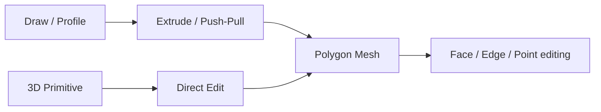

# 02 — Workflow de Modelagem Shape-First

# Dois caminhos de criação igualmente válidos

O Petunia3D não é exclusivamente profile-based. O usuário escolhe o caminho mais simples para o objeto.



# Draw / Profile

## V1

- Line
- Polyline / Polygon Pen
- Rectangle
- Circle com sides explícitos
- Polygon
- Arc com segments explícitos

**Star não faz parte do Core V1.** Pode ser adicionada posteriormente como conveniência V1.x ou por plugin, sem aumentar a superfície inicial de criação.

A Pen Tool inicial gera linhas poligonais. Bézier verdadeira fica para uma evolução posterior, evitando que o projeto dependa de um sistema completo de curvas paramétricas.

O desenho do Petunia é **planar 3D modeling**, não desenho 2D ambíguo: cada Profile está associado a um Work Plane conhecido no espaço 3D. O sistema conhece origem, eixos do plano, normal, posição e contexto de operação. Isso elimina a necessidade de inferir livremente onde um stroke existe no espaço.

## Profile → Volume

Ao fechar uma forma válida, o software pode mostrar preenchimento e uma **Depth Handle**. Arrastar a alça gera uma extrusão imediatamente.

## Low-poly durante a criação

Circle, Arc, Cylinder, Sphere e Bevel expõem densidade geométrica como parte do estilo. Presets possíveis: Very Low, Low, Medium e Custom.

# Primitivas volumétricas

Primitivas são essenciais porque frequentemente são o caminho mais rápido.

## Conjunto Core V1

- Box / Cube
- Plane
- Cylinder
- Cone
- Sphere low-poly / UV Sphere
- Icosphere
- Capsule

As primitivas podem permanecer como **generators paramétricos** enquanto o usuário altera dimensões e segmentos. Quando precisar de edição topológica arbitrária, usa Make Editable / Convert to Mesh.

# Draw on Face

Selecionar uma face plana e ativar Draw alinha a câmera temporariamente à face. Um profile desenhado nela pode:

- Splitar a face.
- Ser puxado para fora como detalhe.
- Ser empurrado para dentro como recess/hole.
- Servir como região para extrusão.

# Revolve e Sweep

**Revolve 360° faz parte do Core V1**. Ele transforma um Profile em volume rotacional com quantidade explícita de segmentos radiais; partial/helical revolve e perfis variáveis permanecem fora da V1 conforme capítulo 14.

**Simple Sweep é Official Extension / V1.x**, não Core V1 e não sweep CAD completo. O contrato detalhado está fechado no capítulo 14: `closed polygon Profile + open polyline Path`, framing por parallel transport, densidade geométrica explícita, caps controlados e falha previsível diante de auto-intersections problemáticas. O objetivo continua ser cabos, tubos, galhos, chifres e formas semelhantes com baixa densidade geométrica controlável.

**Loft fica fora do escopo oficial atual.** Correspondence entre múltiplos profiles, vertex matching, twist, resampling e demais edge cases não justificam o custo para o objetivo do Petunia. Loft poderá existir futuramente via plugin.

# História simples e não destrutiva

Sem construir uma árvore CAD completa, determinados objetos podem manter uma pequena pilha procedural:

```
Profile
↓
Extrude
↓
Mirror
↓
Bevel
```

Cada estágio pode ser ajustável até o usuário decidir converter para mesh editável. A história procedural deve permanecer pequena; operações mesh arbitrárias continuam apoiadas pelo Undo/Redo transacional normal.