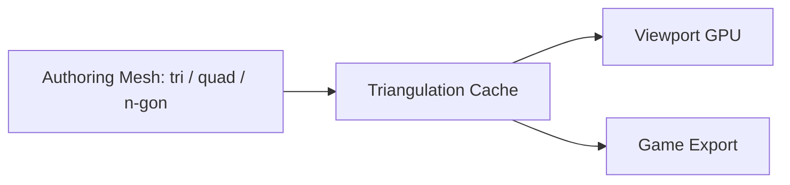

# 03 — Geometry Core, Faces e Topologia

# Decisão fundamental

O núcleo deve ser **polygon mesh**, não NURBS/B-Rep. A UX pode se inspirar em Plasticity/MoI, mas a representação é projetada para low-poly e games.

# Edição direta completa

Sim: o usuário terá acesso a **vertices/points, edges e faces**. Isso é importante para corrigir silhuetas, otimizar polígonos e fazer ajustes que um workflow puramente procedural não consegue prever.

## Camadas de uso

1. **Object/Shape level:** caminho padrão e mais simples.
2. **Face level:** Push/Pull, inset simples, delete, cut, material etc.
3. **Edge level:** move, dissolve, split, bevel/chamfer, bridge.
4. **Point/Vertex level:** ajuste fino, weld, merge, dissolve.

# Triângulos, quads ou ambos?

**Ambos — e também n-gons no authoring quando forem úteis.** A melhor arquitetura não é quad-only nem triangle-only.

## Representação recomendada

O authoring core armazena faces poligonais com loops de vértices/arestas. Portanto uma face pode ser triangle, quad ou n-gon. Para renderização GPU e exportação, o sistema mantém uma **triangulation cache** determinística.

## Por que não trabalhar só com triangles

Triangles são a unidade final mais previsível para a GPU e para engines, mas são mais cansativos para várias operações de edição. Obrigar o artista a trabalhar exclusivamente em tris pioraria muito a UX.

## Por que não trabalhar só com quads

Low-poly frequentemente usa diagonais deliberadas para controlar silhueta, shading e deformação. Além disso, o modelo será triangulado em algum ponto antes de chegar à GPU.

## Ferramentas de triangulação

- Show Triangulation: overlay sem destruir a face original.
- Flip Diagonal: troca a diagonal de um quad.
- Triangulate: operação explícita.
- Auto Triangulate on Export: default seguro.
- Lock Triangulation: preserva decisões artísticas quando necessário.

# Estrutura de dados normativa

A baseline V1 usa **PetuniaMesh próprio em half-edge**, com IDs generacionais tipados, permitindo navegar vertex ↔ edge ↔ face sem espalhar regras de conectividade pela aplicação. Estruturas equivalentes podem existir apenas como detalhe auxiliar/derivado; trocar a representação authoring principal exige ADR arquitetural explícito.

A half-edge mesh é detalhe interno do Geometry Core. APIs públicas, plugins, UI e MCP não recebem ponteiros/referências cruas para essa estrutura. `MeshId` e demais entidades de documento usam identidade persistente; `VertexId`, `HalfEdgeId`, `EdgeId` e `FaceId` são **handles topológicos generacionais, tipados e escopados à mesh**. Eles permanecem válidos enquanto o elemento existir e a operação preservar sua identidade; operações destrutivas podem invalidá-los ou retornar remaps. Stale handles sempre retornam erro estruturado. Toda mutação passa por commands da Application API.

## Invariantes e transactions

Toda mutação geométrica deve ocorrer dentro de uma transaction. Antes do commit, validar pelo menos conectividade básica, referências válidas e consistência de loops/faces afetados. Falhas cancelam a operação e restauram o estado anterior. Um commit concluído gera uma unidade coerente de Undo/Redo.

## Fronteira entre operação local e provider avançado

Extrude, Push/Pull simples, Inset, Split, Dissolve, Weld e outras operações locais devem preferir manipulação direta da topology authoring. Interseções arbitrárias e casos que realmente exigirem CSG são delegados a providers especializados atrás de interfaces do Geometry Core, sem transformar Boolean em fundamento de todas as operações.

# Regra de produto

O iniciante não precisa pensar em tris/quads para criar um asset simples. O usuário avançado consegue visualizar e controlar exatamente a triangulação antes da exportação.
