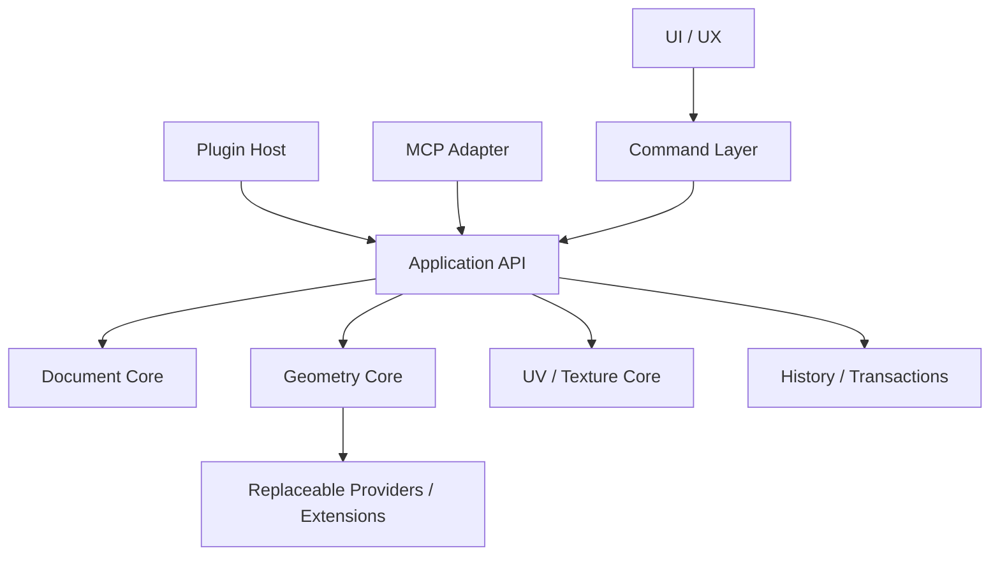

# 09 — Arquitetura, Princípios de Decisão e Governança Técnica

> Este capítulo é **normativo**. Em caso de dúvida arquitetural, suas regras têm precedência sobre preferências de implementação locais. O objetivo é impedir que o Petunia3D cresça por acúmulo de complexidade e preservar sua promessa central: modelagem low-poly extremamente fácil para o usuário e sustentável para um projeto pequeno.

# Autoridade de decisão

O usuário delegou ao responsável técnico do projeto o fechamento autônomo das **decisões de arquitetura e implementação** quando o Livro Vivo já fornecer contexto suficiente: algoritmos, stack e dependências, formatos e schemas internos, providers, pipelines, fronteiras entre crates/módulos, ownership, concorrência, memória/caches, segurança, performance, testes, políticas de robustez, APIs internas e escolhas técnicas equivalentes. Essas decisões devem ser tomadas sem criar perguntas artificiais ao usuário e sempre subordinadas à promessa central de simplicidade do Petunia3D.

**Fronteira da delegação:** mudanças que alterem materialmente identidade do produto, escopo funcional, nomenclatura pública, workflow, UI/UX, branding ou requisitos de acessibilidade continuam sendo decisões de produto e não podem ser introduzidas silenciosamente como consequência de uma escolha arquitetural. O responsável técnico pode recomendar e preparar opções, mas arquitetura não é autorização para expandir o produto.

A partir do marco de 2026-09-11, a fase conjunta de **UI, UX, interface e acessibilidade** foi consolidada como **UI BASELINE FINAL V1**. A plataforma final é Rust + egui + eframe + egui-wgpu + wgpu, conforme ADR 32 e capítulos 27–36. Composição visual, layout, medidas, typography, motion, gestures, shortcuts UX, focus/keyboard navigation, accessibility semantics, Theme Extensions e Plugin Panels passam a obedecer ao capítulo 36. Pequenas calibrações posteriores são tuning; novas features ou mudanças estruturais que alterem identidade/escopo continuam exigindo decisão explícita e não podem ser inventadas pelo framework.

As decisões técnicas devem ser tomadas buscando, nesta ordem:

1. **Facilidade de uso pelo usuário.**
2. **Previsibilidade do comportamento.**
3. **Facilidade de implementação e manutenção.**
4. **Robustez e capacidade de recuperação.**
5. **Performance suficiente para o escopo low-poly.**
6. **Extensibilidade bem delimitada.**
7. **Sofisticação técnica apenas quando trouxer benefício concreto.**

Uma solução mais sofisticada não é automaticamente melhor. Quando duas soluções resolvem o mesmo problema de produto, preferir a que possui menos estados, menos dependências conceituais e menor superfície de falha.

# Regra central de arquitetura

O Petunia3D deve ser um **aplicativo modular com core pequeno**, e não um microkernel radical. Funcionalidades universais permanecem no núcleo; funcionalidades avançadas, especializadas ou substituíveis vivem atrás de contratos e podem ser fornecidas por módulos oficiais ou plugins.

A representação concreta do código segue a **Explicit Modular Data Architecture** definida no capítulo 34. Isso estabelece como regra normativa: dados concretos primeiro; ownership explícito; DOD seletivo; ECS apenas como inspiração de composição/data locality, nunca como `World` universal; `Tool → Command → Algorithm → Data`; traits apenas em extension/provider boundaries reais; long-lived relationships por IDs; single-writer Document; snapshots para renderer/jobs; `unsafe` isolado; e testes como parte do contrato de cada feature.

[34 — Arquitetura Modular Explícita, Rust Safety e Representação em Código](34-arquitetura-modular-rust-safety.md) é a autoridade especializada para representação em código e princípios Rust-safe.



# O que pertence ao Core

O Core contém conceitos necessários para praticamente qualquer workflow do produto:

- Documento/projeto, objetos, seleção e hierarquia básica.
- Identidades persistentes para entidades de documento e handles generacionais validados para componentes topológicos.
- Mesh poligonal authoring com topology consistente.
- Point/Vertex, Edge, Face e loops/boundaries.
- Transformações básicas.
- Work planes, profiles e referências.
- Extrude e Push/Pull simples quando resolvíveis localmente.
- Representação UV e materiais/imagens básicas.
- Commands, transactions, Undo/Redo e validação estrutural.
- Viewport state e seleção, sem acoplar algoritmos avançados ao renderer.
- Application API que serve UI, plugins e MCP.

# O que não deve contaminar o Core

Manter fora do núcleo algoritmos difíceis, substituíveis ou especializados quando isso reduzir risco:

- Boolean robusto arbitrário.
- Sweep avançado.
- Loft.
- Unwrap avançado ou múltiplos algoritmos de packing.
- Retopology/remesh.
- Geradores especializados.
- Importadores/exportadores não essenciais.
- Integrações específicas com engines.
- Ferramentas de nicho.

Essas capacidades podem vir como **Official Extensions** quando fizerem parte da experiência padrão, ou como Community Plugins quando forem opcionais.

# Limite contra overengineering

Não criar abstrações antecipadamente apenas porque uma funcionalidade poderá existir no futuro. Uma interface ou extension point só deve ser estabilizado após pelo menos um uso real pelo próprio Petunia ou por um módulo oficial.

A API pública evolui progressivamente durante 0.x. Compatibilidade rígida só deve ser prometida quando os contratos tiverem sido exercitados por workflows reais.

# Política de dependências

Preferir bibliotecas externas maduras para problemas geometricamente difíceis quando isso for claramente mais simples do que desenvolver o algoritmo internamente. Toda dependência externa deve ficar atrás de uma interface nossa para evitar acoplamento permanente.

Exemplo normativo:

```plain text
Fuse command
    ↓
BooleanService
    ↓
BooleanProvider interface
    ↓
provider oficial
```

O usuário nunca precisa conhecer o provider.

# Estado mutável e segurança de edição

Toda operação que altera documento ou geometria deve passar por uma **transaction**.

```plain text
beginEdit("nome da operação")
    ↓
alterações temporárias
    ↓
validação
    ↓
commit
```

Se houver erro, cancelamento ou falha de plugin, executar rollback. Um commit concluído gera uma entrada coerente no Undo/Redo.

Operações parciais não devem deixar o documento em estado intermediário inválido.

# IDs e encapsulamento

APIs públicas usam **IDs/handles opacos e validados**, nunca ponteiros ou referências diretas à estrutura interna. Entidades de documento (`ObjectId`, `MeshId`, `ProfileId`, `ReferenceId`, `MaterialId`, `TextureId`) possuem identidade persistente. Componentes topológicos (`VertexId`, `EdgeId`, `FaceId`, `HalfEdgeId`) usam handles generacionais escopados à mesh/revisão: permanecem válidos enquanto o elemento existir e a operação preservar sua identidade, mas podem tornar-se stale após operações topologicamente destrutivas ou reconstruções. APIs devem detectar stale handles e retornar erro estruturado em vez de reutilizá-los silenciosamente.

Tipos conceituais:

```plain text
ObjectId
MeshId
FaceId
EdgeId
VertexId
ProfileId
ReferenceId
MaterialId
TextureId
```

Plugins não manipulam diretamente a estrutura half-edge interna. Isso permite trocar detalhes de implementação sem quebrar todo o ecossistema.

# Commands como linguagem comum

A UI deve disparar commands da Application API em vez de alterar o modelo diretamente. O mesmo command pode ser invocado por atalho, menu, plugin, MCP ou teste.

A regra de separação é **Algorithm ≠ Command ≠ Tool**: algorithms executam comportamento de domínio; commands orquestram caso de uso/transaction/validation/Undo; tools contêm apenas estado interativo/preview e convertem input em commands. **Uma Tool não chama outra Tool.** Capacidades compartilhadas descem para command/algorithm comum.

Isso garante:

- Undo/Redo uniforme.
- Logging e diagnóstico.
- Testabilidade sem UI.
- Automação previsível.
- Menor duplicação entre frontend e integrações.

# Política de performance

O Petunia3D é focado em low-poly. Não otimizar para milhões de polígonos se isso complicar significativamente o projeto. Priorizar interação fluida para assets compatíveis com o objetivo do produto, triangulation cache eficiente e atualizações localizadas.

# Política de testes

Cada command geométrico deve poder ser testado fora da UI. Operações sobre topology precisam de testes para invariantes, Undo/Redo e casos degenerados. Providers externos recebem testes de contrato para provar que cumprem a mesma interface.

# Fronteira UI-BOUNDARY

O core deve permanecer implementável/testável sem depender da interface. Dependências da UI usam ports/adapters estreitos. **egui + eframe + egui-wgpu + wgpu são a platform baseline final V1**, e o capítulo 36 define layout, gestures, typography, accessibility tree, focus order, themes e comportamento visual. `petunia-core` e `petunia-geometry` não dependem de egui/eframe/wgpu; `petunia-render` não depende de egui/eframe; somente `petunia-ui` conhece Petunia Components, crates auxiliares e o adapter `egui-wgpu` que integra a região do viewport ao renderer. O vertical slice funciona como teste de conformance; somente bloqueador estrutural comprovado pode reabrir a decisão por novo ADR.

# Regra final

**Simplicidade é requisito arquitetural, não preferência estética.** Se uma nova arquitetura torna o usuário ou o código responsáveis por entender mais conceitos sem entregar ganho proporcional, ela deve ser rejeitada.

Para implementação Rust, a ordem normativa complementar é: concrete data → explicit ownership → simple functions → cohesive modules → typed commands → traits apenas em boundaries reais → dynamic dispatch apenas onde dinamismo existe → concorrência apenas quando útil → `unsafe` apenas em fronteiras auditadas → abstração apenas após variação/repetição real.
