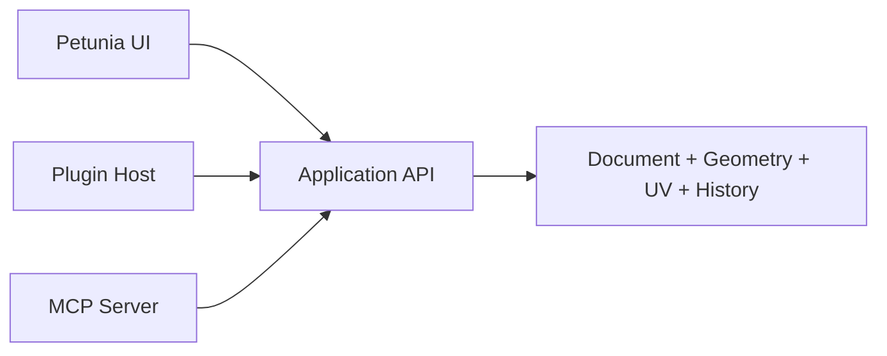

# 11 — MCP API, Automação e Integração com Agentes de IA

> O MCP é um adapter oficial sobre a mesma Application API utilizada pela interface e pelos plugins. Ele não controla o editor por cliques e não recebe acesso irrestrito ao processo. A meta é oferecer automação sem sacrificar previsibilidade, Undo ou segurança.

# Princípio estrutural

Plugins e MCP são **adapters irmãos**.



Não adotar `Plugin → MCP → Core` nem `MCP → Plugin Runtime → Core` como arquitetura obrigatória.

# Por que usar a Application API

A mesma operação realizada pela UI, plugin ou agente deve obedecer às mesmas invariantes:

- seleção e IDs coerentes;
- transactions;
- Undo/Redo;
- validação;
- permissões;
- mensagens de erro estruturadas;
- resultado determinístico quando possível.

# MCP Tools iniciais

Conjunto conceitual de operações de alto nível:

```plain text
create_primitive
create_profile
extrude_profile
push_pull
move
rotate
scale
mirror
select
combine
join
fuse
cut
bevel
project_texture
unwrap_uv
validate_asset
export_asset
```

A lista real deve nascer da Application API implementada. Evitar criar tools que apenas espelham internals de baixo nível.

# MCP Resources iniciais

Recursos de leitura podem expor estado estruturado:

```plain text
scene://objects
scene://selection
object://{id}
mesh://{id}/statistics
mesh://{id}/validation
reference://{id}
material://{id}
texture://{id}
document://settings
```

# Sem execute-script irrestrito

Não oferecer por padrão uma tool como `execute_script(arbitrary_code)`. Agentes devem chamar operações estruturadas com schema conhecido.

Vantagens:

- validação de entrada;
- Undo confiável;
- logging;
- permissões granulares;
- testes;
- menor superfície de segurança;
- capacidade de explicar ao usuário exatamente o que será alterado.

# Permissões

O servidor MCP deve trabalhar com capabilities. Exemplo:

```plain text
read_scene
edit_geometry
edit_uv
edit_materials
import_files
export_files
delete_objects
invoke_plugins
```

Operações destrutivas ou de filesystem podem exigir confirmação/configuração explícita. `read_scene` não implica `edit_geometry`.

# Operações transacionais

Uma chamada MCP que altera geometria executa como transaction. Se um agente pedir uma sequência lógica que deve ser atômica, a API poderá suportar batch/transaction explícita.

Resultado de uma operação deve informar, quando útil:

- IDs criados/alterados;
- warnings;
- triangle count/resulting statistics;
- validações que falharam;
- se houve fallback de algoritmo.

# IA como assistente, não caixa-preta geométrica

Casos de uso desejados:

- criar ou alterar um asset a partir de instruções;
- analisar por que uma região apresenta shading incorreto;
- verificar normals, triangulação e UV;
- alinhar partes repetidas;
- executar Game Ready validation;
- automatizar operações repetitivas;
- sugerir correções antes de aplicá-las.

A IA não deve substituir a representação editável nem gerar um estado impossível de inspecionar/desfazer.

# Exposição opcional de plugins ao MCP

Um plugin pode declarar commands seguros para exposição via MCP. Isso nunca deve acontecer automaticamente sem manifestação do plugin e permissão do usuário.

Fluxo:

```plain text
Plugin registers command
→ declares mcp_exposable
→ user allows capability
→ MCP adapter publishes structured tool
```

# Tool naming e estabilidade

Tools MCP devem ser semânticas e orientadas à intenção do Petunia. Preferir `fuse_objects` a uma sequência de manipulações internas de half-edge. Mudanças na implementação não devem exigir mudanças no contrato do agente quando a intenção permanece igual.

# Observabilidade

Manter log estruturado de chamadas de automação com:

- tool executada;
- parâmetros relevantes não sensíveis;
- resultado;
- warning/error;
- transaction/Undo entry associada.

A UI pode mostrar um pequeno histórico de ações automatizadas para manter confiança e permitir reversão.

# Relação com plugins

O MCP pode descobrir capabilities fornecidas por módulos oficiais e plugins, mas a existência de um plugin nunca deve ser pressuposta. A API deve permitir feature detection.

# Processo e transporte V1

Com a baseline Rust, o MCP oficial passa a ser **`petunia-mcp` em Rust**, usando `rmcp`. Ele pode permanecer como serviço/processo logicamente separado quando isso facilitar integração com clientes, mas não exige mais Go nem um protocolo interno apenas para atravessar linguagens.

O transporte externo padrão continua **stdio** para integrações locais. Streamable HTTP fica fora da V1 local e só entra futuramente se houver um caso remoto explícito.

A implementação MCP usa Tokio **somente dentro de `petunia-mcp`**. Requests são convertidos em commands e enviados por channel à Application/Main thread; MCP nunca recebe posse do `Document`.

Referência: [MCP 2026-07-28](https://blog.modelcontextprotocol.io/posts/2026-07-28/).

# Conexão com o Petunia em execução

`petunia-mcp` **não possui o documento**. Quando executado dentro do mesmo processo, comunica-se com a Application/Main thread por channel tipado. Quando for necessário expô-lo como processo separado para um cliente MCP, usar IPC local-only:

- Unix domain socket em Linux/macOS;
- named pipe/local equivalent em Windows;
- nenhum TCP port aberto por padrão;
- endpoint/token de sessão quando houver processo separado;
- requests sempre convertidos para Application Commands e serializados no single-writer thread.

Se nenhum Petunia compatível estiver disponível, retornar `app_not_connected` com diagnóstico; não abrir projeto headless automaticamente na V1.

# Versão do protocolo

A baseline mira a revisão MCP suportada pelo `rmcp` pinado, inicialmente alinhada à revisão estável `2026-07-28` pesquisada durante a definição da stack. Compatibilidade com revisões futuras é responsabilidade de `petunia-mcp`; Geometry/Application Core não deve mudar quando a semântica dos commands permanecer igual.

# Catálogo V1 congelado

Tools iniciais devem ser poucas e orientadas a intenção:

```plain text
get_document_summary
list_objects
get_object
get_selection
select
create_primitive
create_profile
extrude_profile
push_pull
move
rotate
scale
mirror
connect
weld_points
fuse
cut
slice
bevel
revolve
project_from_reference
auto_uv
pack_uv
validate_asset
export_asset
undo
redo
```

Operações avançadas de edição topológica só entram quando houver caso real; não espelhar cada half-edge primitive como tool MCP.

# Identidade e stale handles

IDs retornados por uma tool podem ficar inválidos após edits destrutivos. Toda tool valida revision/ID e retorna erro estruturado `stale_or_missing_id` em vez de resolver silenciosamente para outro componente.

Para sequências dependentes, tools retornam IDs/remap tables quando necessário.

# Batch atômico

Disponibilizar uma operação transacional de batch apenas para commands já autorizados:

```plain text
begin batch
→ command A
→ command B
→ command C
→ validate
→ commit once
```

Qualquer falha aborta o lote e restaura estado anterior. O batch não aceita arbitrary script.

# Permissões default

Conexões novas começam com leitura e conjunto mínimo aprovado pelo usuário/interface futura. Capabilities de edit, delete, filesystem/export e plugin invocation são independentes. O core aplica permissões novamente; não confiar somente no bridge.

# Long-running operations

Boolean/UV/export podem gerar job assíncrono interno. O MCP adapter acompanha o resultado sem manter mutação parcial no documento. Se o protocolo/SDK oferecer mecanismo oficial para operações longas, o adapter pode adotá-lo sem alterar o contrato Application API.

# Regra final

**MCP automatiza intenções do usuário; não contorna as regras do editor.** Tudo que um agente altera continua sujeito às mesmas invariantes do Petunia3D.
