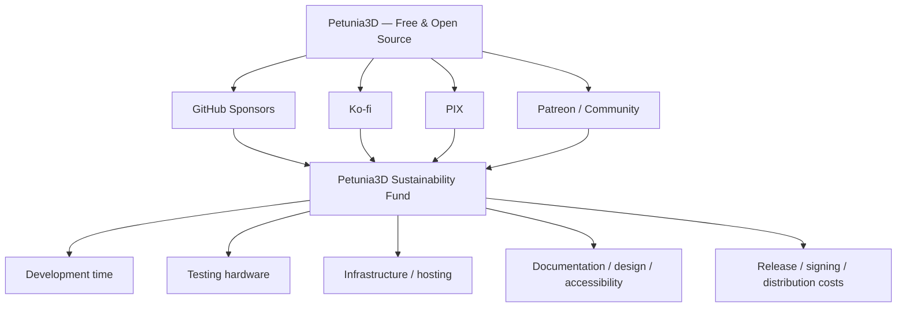

# 37 — Sustentabilidade, Doações, Comunidade e Welcome Screen

<aside>
🌸

**Princípio central:** Petunia3D permanece gratuito e open source. O financiamento existe para comprar tempo de desenvolvimento, infraestrutura, hardware, documentação, testes, acessibilidade e continuidade — **não para bloquear funcionalidades do aplicativo atrás de pagamento**.

</aside>

# Objetivo

Criar uma estratégia de sustentabilidade que permita manter e evoluir o Petunia3D sem transformá-lo em freemium, subscriptionware ou software com edição paga artificialmente limitada.

A relação desejada é simples:

```
Petunia3D
├── software gratuito e open source
├── mesmos recursos de produto para apoiadores e não apoiadores
├── financiamento voluntário
└── benefícios de comunidade/reconhecimento fora do core funcional
```

# Princípios normativos de financiamento

1. **Petunia3D permanece gratuito e open source.**
2. Features centrais do produto não podem ser bloqueadas por tiers de doação.
3. Não existirão formatos de projeto exclusivos para apoiadores.
4. Plugin API, MCP, import/export e formatos públicos não devem ser artificialmente limitados para incentivar pagamento.
5. Não atrasar releases públicas intencionalmente para vender acesso antecipado como requisito de uso.
6. Não inserir anúncios no fluxo de modelagem.
7. Não transformar pedidos de doação em popups intrusivos, timers, contadores de horas de uso ou nagware.
8. Doação não compra autoridade sobre o roadmap.
9. Apoiadores podem sugerir prioridades e participar de votações comunitárias não vinculantes, mas decisões de produto/arquitetura continuam seguindo a governança técnica e a visão do Petunia3D.
10. Patrocinadores corporativos recebem reconhecimento, não controle do projeto.

# Canais de apoio

## GitHub Sponsors — canal principal recorrente

**Papel:** principal canal de apoio recorrente para pessoas que já acompanham o projeto pelo GitHub.

Integrações planejadas:

- botão **Sponsor** no repositório;
- `.github/FUNDING.yml`;
- link no README;
- link no site oficial;
- link na Welcome Screen;
- link em `Help → Support Petunia3D`;
- possibilidade de tiers recorrentes;
- reconhecimento opcional em `SUPPORTERS.md` e site.

O software não verifica se uma pessoa é GitHub Sponsor para liberar funções.

## Ko-fi — apoio rápido e doações avulsas

**Papel:** canal simples para quem deseja agradecer com uma contribuição única ou recorrente sem entrar em uma comunidade formal de membership.

Integrações planejadas:

- botão no site;
- botão na página Support;
- link na Welcome Screen;
- link no menu Help;
- QR/link onde fizer sentido em materiais de divulgação.

Ko-fi deve ser apresentado como **apoio voluntário**, não como checkout do aplicativo.

## PIX — canal brasileiro de baixo atrito

**Papel:** facilitar contribuições no Brasil, inclusive para usuários sem cartão internacional.

Diretrizes:

- exibir chave PIX apenas em superfícies explícitas de suporte: site, página Support, Welcome Screen expandida/diálogo Support e documentação de contribuição;
- preferir QR Code PIX e opção de copiar a chave/código;
- nunca embutir dados bancários sensíveis além do que for necessário para receber pagamentos;
- permitir substituir futuramente a chave por uma chave empresarial/projeto quando houver estrutura jurídica própria;
- não acoplar PIX ao formato de projeto, telemetria ou conta de usuário;
- não exigir login para doar.

### UI proposta para PIX

```
Support Petunia3D

Brazil / PIX
[ QR CODE ]

PIX key: ********
[ Copy PIX key ]

Thank you for supporting free and open-source development.
```

O QR Code e a chave reais **não devem ser hardcoded no código-fonte se isso criar dificuldade operacional**. Preferir configuração/recurso de distribuição ou URL do site quando apropriado.

## Patreon — comunidade/devlogs, opcional

Patreon permanece uma opção complementar caso exista produção regular de conteúdo de desenvolvimento:

- devlogs;
- bastidores;
- screenshots/protótipos;
- decisões de design;
- relatórios de implementação;
- enquetes não vinculantes;
- posts sobre roadmap.

Patreon não deve receber uma build funcionalmente superior como forma permanente de monetização.

## Futuro: patrocinadores corporativos e Open Collective

Quando o projeto tiver escala suficiente, avaliar:

- patrocínios de estúdios/empresas;
- Open Collective ou estrutura equivalente para transparência financeira;
- serviços profissionais: integração de pipeline, plugins customizados, treinamento, consultoria, suporte e importadores/exportadores específicos.

O produto continua gratuito; **serviços profissionais podem ser cobrados porque remuneram trabalho específico, não o acesso ao Petunia3D**.

# Arquitetura dos canais de suporte



# Welcome Screen / Home

A Welcome Screen deve funcionar primariamente como **Home do produto**, não como tela de pedido de dinheiro.

## Estrutura visual proposta

```
┌──────────────────────────────────────────────────────────┐
│ 🌸 Petunia3D                                  vX.Y.Z     │
│                                                          │
│  Create                                                   │
│  ┌───────────────┐  ┌───────────────┐                    │
│  │ New Project   │  │ Open Project  │                    │
│  └───────────────┘  └───────────────┘                    │
│                                                          │
│  Recent Projects                                         │
│  ──────────────────────────────────────────────────────  │
│  Character.petunia                                       │
│  Environment.petunia                                     │
│                                                          │
│  Learn                          What's New                │
│  Getting Started                Petunia3D X.Y             │
│  Modeling Basics                Release highlights       │
│  UV & Painting                  Read changelog            │
│                                                          │
│  ──────────────────────────────────────────────────────  │
│  ❤️ Petunia3D is free and open source.                   │
│     Support its continued development.                   │
│                                                          │
│  [ Support Petunia3D ]  [ Website ]  [ GitHub ]          │
└──────────────────────────────────────────────────────────┘
```

## Conteúdo principal

A ordem de importância é:

1. New Project;
2. Open Project;
3. Recent Projects;
4. Learn / Documentation;
5. What's New / Release notes;
6. Support;
7. Website / GitHub / Community.

O suporte financeiro fica visível, mas secundário ao trabalho do usuário.

## Comportamento do botão Support

`Support Petunia3D` abre uma visão compacta com:

- GitHub Sponsors;
- Ko-fi;
- PIX / QR Code;
- Patreon, caso ativo;
- texto curto explicando por que contribuir;
- link para página de sustentabilidade do site.

Links externos devem indicar claramente que abrirão o navegador.

## Regras anti-nagware

Proibido:

- popup periódico solicitando doação;
- modal após X horas de uso;
- banner persistente no viewport;
- bloquear fechar a tela sem responder ao pedido;
- “Donate to remove this message”;
- reduzir funcionalidade de não apoiadores;
- badges intrusivos dentro do fluxo de modelagem.

A Home, menu Help, About, README, site e release notes são superfícies suficientes.

# Menu Help e About

Estrutura recomendada:

```
Help
├── Getting Started
├── Documentation
├── Keyboard Shortcuts
├── Report a Bug
├── GitHub
├── Website
├── Community / Discord
├── ───────────────────
├── ❤️ Support Petunia3D
├── Become a Sponsor
├── ───────────────────
└── About Petunia3D
```

About pode incluir:

```
Petunia3D
Free and Open Source 3D Modeling

Made possible by contributors and people who support its development.

[ Support Development ]
```

# Tiers de apoio

Tiers servem para reconhecimento e comunidade, não para limitar o aplicativo.

| Tier | Referência inicial | Benefícios possíveis |
| --- | --- | --- |
| 🌱 Seed | US$ 2/mês | Nome opcional na página de apoiadores; badge no site. |
| 🌿 Sprout | US$ 5/mês | Anterior + supporter role futura no Discord/site. |
| 🌸 Petunia | US$ 10/mês | Anterior + acesso organizado a devlogs, bastidores e posts de desenvolvimento. |
| 🌺 Garden | US$ 25/mês | Anterior + destaque opcional nos créditos/site e participação em enquetes comunitárias. |
| 🌳 Maintainer Supporter | US$ 50/mês | Reconhecimento especial; nenhum poder técnico/decisório adicional. |
| 🏢 Studio Sponsor | US$ 100+/mês | Logo/nome em área de sponsors do site conforme política de exposição. |
| 🏢 Corporate Sponsor | US$ 500+/mês | Reconhecimento institucional e página de sponsors; sem autoridade sobre roadmap. |

Valores são referências iniciais e podem ser ajustados sem alterar a filosofia.

# Benefícios permitidos

Benefícios devem ser predominantemente **sociais, editoriais ou de reconhecimento**.

Permitidos:

- nome opcional em `SUPPORTERS.md`;
- perfil/badge de supporter no site;
- nome em página de apoiadores;
- destaque por tier no site;
- Discord role;
- acesso organizado a devlogs/bastidores;
- enquetes não vinculantes;
- participação em discussões comunitárias;
- wallpapers/artwork;
- agradecimento em release notes;
- nome/créditos, com consentimento;
- convite para sessões comunitárias quando existirem.

Não permitidos como mecanismo estrutural de monetização:

- ferramentas exclusivas no Petunia3D;
- exportadores essenciais pagos;
- project format pago;
- plugin API paga;
- MCP pago;
- desempenho artificialmente reduzido;
- builds públicas deliberadamente atrasadas por longos períodos para criar paywall.

# Site oficial do Petunia3D

O futuro site deve ser parte central da estratégia de comunidade e sustentabilidade.

## Áreas propostas

```
petunia3d.*
├── Home
├── Download
├── Features
├── Documentation
├── Learn
├── Roadmap
├── Changelog
├── Community
├── Sponsors
├── Support
├── Blog / Devlogs
└── GitHub
```

## Página Support

Conteúdo:

- “Petunia3D is free and open source. Always.”;
- por que o projeto aceita apoio;
- GitHub Sponsors;
- Ko-fi;
- PIX;
- Patreon quando ativo;
- funding goals;
- sponsors;
- transparência futura;
- canais para empresas.

## Benefícios direcionados ao site

Apoiadores podem receber recursos **no site**, sem afetar as features do aplicativo:

- supporter badge no perfil/comunidade futura;
- nome em Supporters Wall;
- avatar opcional;
- destaque visual proporcional ao tier sem ranking competitivo agressivo;
- perfil/link opcional;
- histórico/tempo como apoiador quando possível e consentido;
- sponsor logo para Studio/Corporate;
- acesso a uma área que agrega devlogs, bastidores, votações e posts já destinados a apoiadores;
- badges comemorativos de campanhas/versões;
- participação em polls de polish/documentação/prioridades pequenas.

Privacidade: reconhecimento deve ser **opt-in**. Doação anônima continua válida.

# Funding goals e transparência

O site pode mostrar metas de capacidade, não venda antecipada de features.

Exemplo conceitual:

```
Monthly funding

R$ 500   → infrastructure covered
R$ 1.500 → more dedicated development time
R$ 3.000 → regular development days
R$ 5.000 → meaningful part-time sustainability
R$ 10.000+ → evaluate long-term/full-time sustainability
```

Evitar promessas rígidas do tipo “R$ X libera Feature Y em data Z”. O financiamento aumenta **capacidade de desenvolvimento**, não vende feature futura.

Possíveis destinos transparentes:

- tempo de desenvolvimento;
- domínio/hosting/CDN;
- Windows/Linux test machines;
- hardware GPU/low-end para compatibilidade;
- code signing;
- documentação;
- acessibilidade;
- design;
- infraestrutura CI/release;
- serviços externos estritamente necessários.

# Discord / comunidade futura

Criar Discord apenas quando houver capacidade mínima de moderação/manutenção.

Estrutura inicial possível:

```
WELCOME
├── #welcome
├── #rules
├── #announcements
└── #roles

PETUNIA3D
├── #general
├── #showcase
├── #help
├── #feedback
├── #feature-discussion
├── #bugs-links
└── #plugins

DEVELOPMENT
├── #devlogs
├── #roadmap-discussion
└── #contributors

SUPPORTERS
├── #supporters-lounge
└── #behind-the-scenes
```

`SUPPORTERS` pode oferecer ambiente social/conteúdo de bastidores, mas **não é requisito para obter suporte técnico básico, reportar bugs ou acessar documentação pública**.

## Roles possíveis

- Contributor;
- Supporter — Seed;
- Supporter — Sprout;
- Supporter — Petunia;
- Supporter — Garden;
- Studio Sponsor;
- Corporate Sponsor;
- Maintainer/Moderator.

Evitar dezenas de roles cosméticas difíceis de manter.

# Website + Discord + funding identity

A identidade de apoio deve ser coerente entre canais:

```
GitHub Sponsors / Ko-fi / Patreon / PIX
                ↓
       supporter identity (opt-in)
                ↓
     Site profile / Supporters Wall
                ↓
          Discord role futura
```

Não construir autenticação própria apenas para doações na V1 do site. Começar simples e evoluir quando volume justificar.

# Métricas saudáveis

Acompanhar sem transformar comunidade em funil agressivo:

- número de apoiadores recorrentes;
- receita recorrente mensal aproximada;
- contribuições PIX/Ko-fi avulsas;
- custo mensal de infraestrutura;
- horas/dias que o financiamento permite dedicar ao projeto;
- crescimento de downloads/stars/contributors;
- conversão da Welcome Screen apenas em nível agregado se houver telemetria consentida — **não adicionar tracking invasivo apenas para medir doações**.

# Implementação no produto

Criar contratos sem acoplar os provedores financeiros à aplicação:

```
SupportLinkId
├── GitHubSponsors
├── KoFi
├── Pix
├── Patreon
├── WebsiteSupport
└── CorporateSponsor
```

A UI apenas resolve links/configuração através de um `SupportLinks`/`CommunityLinks` provider.

Não incluir SDK de pagamento no aplicativo. Todos os pagamentos acontecem fora do Petunia3D, em browser/site/PIX.

# i18n e acessibilidade

Todo texto de Support/Welcome deve usar `TextId` e participar da cobertura total de i18n.

Botões/links devem possuir:

- accessible name;
- tooltip quando necessário;
- foco de teclado;
- indicação de link externo;
- contraste e hit targets adequados;
- fallback quando URL/canal estiver indisponível.

PIX QR Code deve ter alternativa textual/copiar código para não depender de leitura visual do QR.

# Segurança e privacidade

- não armazenar dados de cartão;
- não implementar checkout próprio no desktop;
- não coletar identidade de doador sem necessidade/consentimento;
- reconhecimento público é opt-in;
- URLs de suporte devem vir de configuração trusted/bundled e usar HTTPS quando aplicável;
- nunca permitir que packs/plugins alterem links oficiais de doação sem autorização explícita;
- proteger o site contra impersonation/phishing de PIX e canais de pagamento;
- documentar os canais oficiais em uma única página canônica.

# Roadmap de adoção

## Fase 1 — Fundação

- [ ]  GitHub Sponsors configurado;
- [ ]  `.github/FUNDING.yml`;
- [ ]  Ko-fi criado;
- [ ]  PIX oficial definido;
- [ ]  página Support no futuro site;
- [ ]  links no README;
- [ ]  `SupportLinkId`/configuração no produto.

## Fase 2 — Welcome Screen

- [ ]  Home com New/Open/Recent;
- [ ]  Learn;
- [ ]  What's New;
- [ ]  Support footer/card;
- [ ]  Help → Support;
- [ ]  About → Support Development;
- [ ]  testes de links, teclado, i18n e acessibilidade.

## Fase 3 — Tiers e site

- [ ]  tiers estabilizados;
- [ ]  Supporters Wall opt-in;
- [ ]  badges no site;
- [ ]  sponsor logos;
- [ ]  funding goals;
- [ ]  devlogs/blog;
- [ ]  área de benefícios editoriais/comunitários.

## Fase 4 — Comunidade

- [ ]  Discord quando houver capacidade de moderação;
- [ ]  roles integradas manualmente inicialmente;
- [ ]  canais de showcase/help/feedback/contributors;
- [ ]  supporters lounge sem bloquear conteúdo técnico essencial.

## Fase 5 — Escala

- [ ]  avaliar Open Collective/estrutura fiscal;
- [ ]  programa formal de Corporate Sponsors;
- [ ]  serviços profissionais;
- [ ]  transparência financeira mais estruturada.

# Definition of Done para suporte no aplicativo

A feature Support/Welcome só está completa quando:

- não interfere no fluxo de trabalho;
- funciona sem login;
- não contém nagware;
- todos os links são configuráveis/testados;
- GitHub Sponsors, Ko-fi e PIX são representados corretamente;
- conteúdo é localizado;
- keyboard/focus/accessibility passam;
- ausência de rede não impede abrir/criar projetos;
- falha ao abrir link externo gera feedback discreto;
- nenhum dado financeiro é processado pelo executável;
- screenshots/visual regression cobrem Welcome e Support;
- temas claros/escuros e escalas de UI são validados.

# Frase pública recomendada

> **Petunia3D is free and open source. Always. If it helps you create, consider supporting its continued development.**
> 

Essa mensagem deve orientar toda a comunicação de sustentabilidade: contribuição como convite, nunca obrigação.