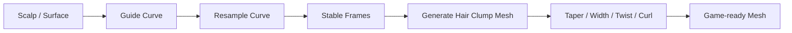
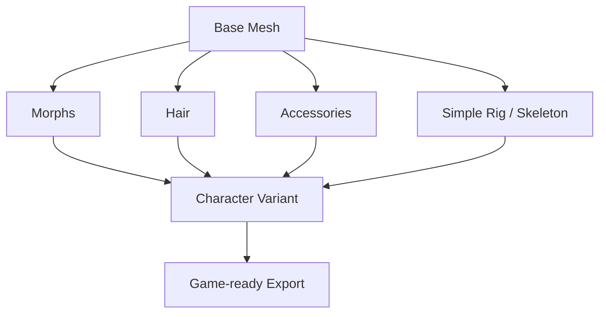

# 38 — Pós-V1: Low-Poly Hair, Mesh Morphs e Character Authoring

<aside>
🧩

Esta página reúne sistemas de **Character Authoring pós-V1** para o Petunia3D. Ela não altera a baseline V1 congelada: define experimentos e módulos opcionais que podem ampliar o Petunia para criação de personagens game-ready sem transformá-lo em um DCC generalista ou em um character creator completo.

</aside>

# Status e regra de escopo

- **Fase:** pós-V1 / pós-GA.
- **Princípio:** simple first, game-ready, low-poly e modular.
- **Não objetivo:** simulação física realista de cabelo, sculpting avançado, rig procedural completo ou sistema de personagens comparável a MetaHuman/Character Creator.
- Sistemas desta página devem preferir operações previsíveis, leves, reversíveis quando possível e compatíveis com exportação para engines.
- Cada sistema deve poder existir como módulo oficial independente e, quando fizer sentido, expor uma superfície limitada à Extension API.

Relacionamentos:

- [04 — Combine, Fuse, Weld e Personagens](04-combine-fuse-weld-personagens.md)
- [10 — Extension API, Plugins e Módulos Oficiais](10-extension-api-plugins-modulos.md)
- [18 — Stack Técnica, Dependências e Fronteiras de Integração](18-stack-tecnica-dependencias.md)

# Sistema A — Petunia Low-Poly Hair Designer

## Objetivo

Criar cabelos estilizados e game-ready através de **guide curves que geram mechas geométricas low-poly**, evitando sistemas strand-based pesados.

## Conceito central



## V1 do módulo Hair

- Draw Hair: desenhar uma curva diretamente sobre a cabeça ou superfície selecionada.
- Guide Curve editável por control points.
- Geração de mecha por curva.
- Perfis iniciais: Ribbon, Triangle, Diamond, Box e low-poly Tube.
- Root Width e Tip Width.
- Thickness.
- Segments.
- Taper.
- Twist.
- Curvature simples.
- Attach to Surface.
- Mirror / Symmetry.
- Convert to Mesh.
- Undo/Redo integrado ao Command System.

## Representação sugerida

```rust
pub struct HairGuide {
    pub id: HairGuideId,
    pub control_points: Vec<HairControlPoint>,
    pub profile: HairProfile,
    pub root_attachment: Option<SurfaceAttachment>,
    pub parameters: HairParameters,
}
```

A raiz deve preferir attachment por triângulo + coordenadas baricêntricas + normal local, em vez de armazenar apenas uma posição absoluta.

## Geração de mesh

A curva é reamostrada em pontos regulares. Para cada sample, o gerador calcula tangent + frame estável e cria a seção transversal correspondente. Preferir **parallel transport frames** para reduzir twists indesejados em curvas onde Frenet frames seriam instáveis.

## Evolução incremental

| Etapa | Recurso | Dificuldade |
| --- | --- | --- |
| H0 | Curve → Ribbon Mesh | 3/10 |
| H1 | Width, Segments, Taper | 3/10 |
| H2 | Solid Clumps / Profiles | 4/10 |
| H3 | Attach to Scalp | 5/10 |
| H4 | Mirror / Symmetry | 3/10 |
| H5 | Draw Hair Tool | 5/10 |
| H6 | Cluster / Variations | 5/10 |
| H7 | Comb / Smooth / Cut / Lengthen | 6/10 |
| H8 | Curl / Wave | 6/10 |
| H9 | Guide Interpolation | 7/10 |
| H10 | Braids Procedurais | 7/10 |

## Fora do escopo inicial

- simulação strand-by-strand;
- colisão física de milhares de fios;
- groom realista;
- solver de dinâmica de cabelo;
- sistemas comparáveis a XGen/Ornatrix.

# Sistema B — Simple Mesh Morph / Morph Targets

## Objetivo

Permitir variações controladas de uma mesma malha base para **customização de personagens em games**, expressões simples e criação de variantes sem duplicar o asset inteiro.

## Grau de dificuldade

**Morph Targets básicos: 4/10.**

A parte matemática é simples. A maior dificuldade é definir regras claras de topologia, UX, edição, combinação de morphs e exportação.

## Modelo mental

Uma malha base possui posições de vértices:

```
Base Vertex = P
Morph Delta = D
Weight = w
Result = P + D * w
```

Vários morphs podem ser combinados:

```
Result = Base
       + FaceWidthDelta * face_width
       + NoseSizeDelta * nose_size
       + JawDelta * jaw
```

## Restrição essencial

Todos os morph targets de uma malha devem preservar:

- o mesmo número de vértices;
- a mesma ordem/identidade dos vértices;
- a mesma topologia de faces/edges durante o morph;
- preferencialmente os mesmos UVs e materiais.

Operações que mudem topologia durante a criação de um morph devem ser bloqueadas ou exigir bake/duplicação explícita.

## UX sugerida

### Morph Mode

1. Selecionar uma mesh base.
2. `Add Morph`.
3. Nomear, por exemplo `Jaw Wide`.
4. Petunia cria um target com deltas inicialmente zero.
5. Usuário move vertices/edges/faces normalmente.
6. Somente deslocamentos geométricos permitidos; mudanças topológicas ficam desabilitadas.
7. Sair do Morph Mode.
8. Slider `0.0 → 1.0` controla o resultado.

### Morph Panel

```
MORPHS
────────────────────
Body Height      [0.42]
Body Width       [0.15]
Head Size        [0.60]
Jaw Width        [0.25]
Nose Size        [0.10]
Ear Size         [0.00]

[ + Add Morph ]
[ Duplicate ]
[ Mirror ]
[ Bake Result ]
```

## Representação sugerida

```rust
pub struct MorphTarget {
    pub id: MorphTargetId,
    pub name: String,
    pub position_deltas: Vec<Vec3>,
}

pub struct MorphWeight {
    pub target: MorphTargetId,
    pub weight: f32,
}
```

Guardar **deltas** em vez de cópias completas das posições facilita serialização, blending e comparação.

## Níveis possíveis

| Nível | Capacidade | Dificuldade |
| --- | --- | --- |
| M0 | Um morph target + slider | 3/10 |
| M1 | Múltiplos morphs combináveis | 4/10 |
| M2 | Mirror morph | 4/10 |
| M3 | Per-vertex masks | 5/10 |
| M4 | Preset groups: Face / Body | 4/10 |
| M5 | Corrective morphs dirigidos por bones | 7/10 |
| M6 | Automatic retarget entre topologias distintas | 9/10 |

## Primeira recomendação

Implementar somente **M0–M4** no pós-V1. Isso já permite um character customization system útil sem entrar em retargeting ou corrective shapes complexos.

# Character Authoring — arquitetura modular proposta

Em vez de criar um único "Character Creator", organizar recursos independentes que podem ser combinados:



# Outros sistemas candidatos pós-V1

| Sistema | Objetivo | Dificuldade estimada | Prioridade sugerida |
| --- | --- | --- | --- |
| Accessory Sockets | Pontos de encaixe para chapéu, arma, mochila, óculos etc. | 3/10 | Alta |
| Character Presets | Salvar combinações de morphs, cabelo, cores e acessórios | 3/10 | Alta |
| Material Variant Sets | Variações de pele, roupa, olhos e cabelo sem duplicar mesh | 3/10 | Alta |
| Simple Skeleton Authoring | Criar/editar bones e hierarquia básica | 6/10 | Média |
| Automatic Basic Weights | Pesos iniciais por proximidade/heat-like approximation | 7/10 | Média |
| Manual Weight Paint | Correção simples de skinning | 6/10 | Média |
| Pose Preview | Testar rapidamente deformação do personagem | 5/10 | Média |
| Simple Facial Morphs | Blink, smile, mouth open etc. | 4/10 | Alta após Morphs |
| LOD Generator | Gerar variantes simplificadas para games | 7/10 | Média/Alta |
| Collision Generator | Capsules/boxes/hulls game-ready | 4–6/10 | Alta |
| Socket / Marker Authoring | Attachment points, spawn points e markers exportáveis | 3/10 | Alta |
| Hitbox Authoring | Volumes por bone/parte para games | 4/10 | Média |
| Modular Body Parts | Cabeça/corpo/mãos/roupas intercambiáveis | 5/10 | Alta |
| Vertex Color Masks | Máscaras de material/tint diretamente na mesh | 4/10 | Alta |
| Decal Placement | Tatuagens, logos, sujeira e detalhes localizados | 5/10 | Média |
| Simple Cloth Conform | Ajustar roupa simples à superfície do corpo | 7/10 | Baixa inicialmente |

# Combinação recomendada para Character Customization

Uma primeira cadeia de valor forte e relativamente barata seria:

```
Base Mesh
→ Morph Targets
→ Material Variants
→ Hair Clumps
→ Modular Accessories
→ Sockets
→ Character Presets
→ Export
```

Isso permite produzir personagens customizáveis para games sem depender inicialmente de rigging avançado.

# Decisão preliminar

- **Low-Poly Hair Designer:** aprovado como candidato forte de módulo oficial pós-V1.
- **Simple Mesh Morph:** candidato recomendado; excelente relação capacidade/dificuldade para criação de personagens customizáveis.
- **Character Authoring:** tratar como uma coleção de módulos pequenos e interoperáveis, não como uma persona/workspace monolítica neste momento.
- Preservar o foco principal do Petunia: criação de assets low-poly simples, previsível e game-ready.

# Expansão — Surface Details, Props e Procedural Assets

A exploração pós-V1 foi ampliada além de personagens. Duas especificações especializadas agora complementam esta página:

- [39 — Pós-V1: Decals, Surface Details e Facial Atlases](39-pos-v1-decals-surface-details-facial-atlas.md)
- [40 — Pós-V1: Spline Core e Procedural Path Generators](40-pos-v1-spline-core-procedural-path-generators.md)

## Prioridade de produto atualizada

**Decals / Surface Details** tornam-se um dos candidatos de maior prioridade imediatamente após a V1/GA, porque atendem simultaneamente personagens, roupas, props, veículos e ambientes e reduzem dependência de modelagem geométrica para detalhes pequenos.

## Ideias de alto valor para props e objetos

| Recurso | Exemplos | Dificuldade | Direção |
| --- | --- | --- | --- |
| Decals | labels, logos, damage, dirt, cracks, serials | 3–6/10 | Alta prioridade oficial |
| Spline Core | paths reutilizados por generators e hair | 5/10 | Core pós-V1 |
| Cable / Pipe | fios, mangueiras, canos | 3–4/10 | Módulo oficial |
| Fence / Wall | cercas, muretas, corrimãos | 4–5/10 | Módulo oficial |
| Trim / Molding | bordas, rodapés, molduras | 4/10 | Módulo/Generator |
| Material Variants | paint jobs, skins, wear states | 3/10 | Alta prioridade |
| Damage Variants | normal/damaged/broken visual state | 4–5/10 | Decals + variants + morph opcional |
| Simple LOD Set | LOD0/1/2 | 5–7/10 | Já previsto no roadmap |
| Collider Authoring | box/capsule/hull/custom | 4–6/10 | Já previsto no roadmap |
| Socket Markers | muzzle, wheel, handle, spawn, snap | 3/10 | Já previsto no roadmap |
| Pivot / Origin Presets | floor, center, hinge, wheel center | 2–3/10 | Quick win |
| Scale Reference / Validator | human, door, meter grid, engine presets | 2–3/10 | Quick win |
| Batch Export Profiles | Unity/Godot/Unreal naming + axes | 4/10 | High-value pipeline |

# Regra anti-bloat consolidada

Não tratar toda feature como plugin. O modelo recomendado passa a ser:

```
Petunia Core
    ↓
Shared primitives / Commands / file format
    ↓
Official Optional Modules
    ↓
Community Plugins / engine-specific adapters
```

**Core:** tudo que é fundamento compartilhado por vários sistemas, como Spline Core, surface attachment, Commands, serialization e export contracts.

**Official Optional Module:** recursos de alto valor e maior superfície de UI, como Hair, Decals avançados, Fence/Wall, Cable/Pipe e Morph authoring.

**Community Plugin:** nichos, generators temáticos, engines específicas, studio pipelines e presets especializados.

Isso mantém a instalação base cognitivamente simples sem fragmentar fundamentos que precisam interoperar.