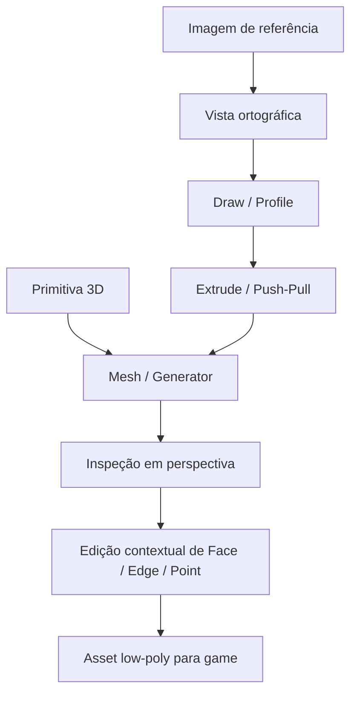

# Petunia3D — Livro Vivo

> **Petunia3D** é o nome provisório de um modelador 3D focado em tornar a criação de assets low-poly tão simples quanto desenhar sobre uma referência. A prioridade do produto é reduzir a carga cognitiva da modelagem 3D sem retirar controle técnico quando ele for necessário.

## Visão do produto

O Petunia3D será um **modelador low-poly shape-first e direct-mesh**, inspirado principalmente pela simplicidade conceitual do MoI 3D, interação direta do Plasticity, acessibilidade low-poly do Blockbench e edição de mesh do Blender — sem adotar um kernel CAD/NURBS como arquitetura central.

### Princípios centrais

- **Draw first, quando fizer sentido:** permitir modelar desenhando silhuetas e perfis sobre imagens de referência.
- **Primitives first, quando for mais rápido:** cubos, cilindros, esferas e outras primitivas volumétricas permanecem cidadãos de primeira classe.
- **Orthographic while creating:** vistas ortográficas são o ambiente principal para traçado, alinhamento e trabalho sobre referências.
- **Perspective while inspecting:** a perspectiva entra naturalmente ao orbitar e inspecionar volume.
- **Mesh underneath:** a geometria final é poligonal e previsível para games.
- **Low-poly by design:** número de lados, segmentos e densidade geométrica fazem parte da criação, não de uma conversão tardia.
- **Simple first, advanced available:** o fluxo principal não exige conhecimento de topologia, mas vertices, edges e faces continuam acessíveis.

## Paradigma de modelagem

## Decisões consolidadas até aqui

### Câmera e referências

- Traçado sobre referência usa **ortográfica** por padrão.
- Orbitar leva naturalmente para **perspectiva**.
- Front, Side e Top retornam à ortográfica.
- Selecionar uma face e desenhar sobre ela pode alinhar temporariamente a câmera ortogonalmente à face.
- Reference Sets podem conter Front, Side, Back e Top.
- Referências devem oferecer opacity, lock, x-ray/overlay e alinhamento manual previsível na V1; Landmark Alignment fica para V1.x.
- Um **Silhouette Mode** ajudará a comparar rapidamente modelo e referência.

### Criação por desenho

- Pen/Polygon Pen inicialmente trabalha com geometria poligonal, não NURBS.
- Profiles podem nascer de Line, Polyline, Polygon, Rectangle, Circle, Arc e formas simples.
- Formas fechadas podem ser preenchidas e extrudadas.
- Formas internas podem representar holes quando tecnicamente válido.
- Extrude deve ter uma alça visual de profundidade imediatamente manipulável.
- Draw on Face será um fluxo central para criar cortes, recessos e detalhes.

### Criação por primitivas

- Primitivas 3D com volume serão suportadas diretamente, incluindo **Capsule no Core V1**.
- Primitivas devem nascer com parâmetros low-poly explícitos e edição visual simples.
- Sempre que útil, permanecem procedurais até o usuário torná-las editáveis como mesh.

### Edição direta

- Edição de **Object / Face / Edge / Point** será suportada.
- O fluxo principal será contextual e não dependerá obrigatoriamente de um Edit Mode rígido.
- Operações avançadas continuam disponíveis para quem precisar de controle topológico.

### Operações essenciais

- Move / Rotate / Scale
- Extrude e Push/Pull
- Cut / Slice
- Bevel / Chamfer de **1 segmento no Core V1**; múltiplos segmentos ficam para evolução posterior
- Mirror
- **Combine** com `Keep Parts / Join / Fuse / Connect`
- Weld / Stitch / Bridge permanecem mecanismos técnicos/avançados usados principalmente por Connect
- **Fuse**, cuja semântica é Union quando uma fusão geométrica real for necessária
- **Cut**, que pode usar Difference internamente quando uma operação topológica local não resolver o caso
- Triangulação previsível e visualizável

Boolean não é um paradigma exposto como centro da modelagem. Intersect e operações booleanas especializadas ficam fora do fluxo principal e podem ser oferecidas por módulos/extensões.

## Filosofia de complexidade

Não construir um mini-Rhino nem um mini-Plasticity baseado em B-Rep/NURBS. A meta é reproduzir a **ergonomia** desses workflows sobre um núcleo poligonal adequado a low-poly. Isso preserva controle de topologia, reduz substancialmente a implementação e mantém exportação direta para pipelines de games.

## Governança técnica

As decisões de **arquitetura e implementação** permanecem delegadas ao responsável técnico sempre que o Livro Vivo já fornecer contexto suficiente: algoritmos, dependências, formatos/schemas internos, providers, pipelines, crates/módulos, ownership, concorrência, memória/caches, segurança, robustez, performance, testes e APIs internas devem ser fechados autonomamente sem criar perguntas técnicas desnecessárias. A fase conjunta de **UI/UX/interface/acessibilidade foi concluída como baseline V1**. Mudanças que alterem materialmente identidade do produto, escopo funcional, nomenclatura pública, workflow, UI/UX, branding ou acessibilidade continuam exigindo decisão explícita de produto.

A stack final é **Rust 2024 + egui + eframe + egui-wgpu + wgpu + Geometry Core próprio em Rust**, formalizada nos capítulos 27–36. O capítulo 34 define a arquitetura normativa de representação/implementação; o capítulo 35 define Petunia Components/adapters/ecossistema egui; e o **capítulo 36 congela a UI Baseline Final V1, Theme Extensions e Plugin Panels**. Essa consolidação não reabre o escopo funcional já fechado.

Novas features que alterem materialmente a identidade ou o escopo do produto não podem ser introduzidas silenciosamente pelo framework.

A ordem normativa para decisões técnicas é: facilidade de uso → previsibilidade → facilidade de implementação/manutenção → robustez → performance suficiente para low-poly → extensibilidade → sofisticação técnica.

## Estado

**Fase:** **escopo de produto V1 + comportamento/core funcional + UI Baseline V1 congelados**; fase ativa: **implementação, vertical slice de conformance e refinamento/tuning**.

**Nome provisório:** Petunia3D.

**Prioridade absoluta:** ser uma das experiências mais fáceis possíveis para transformar referências e ideias visuais em modelos low-poly 3D, mantendo um core pequeno e uma superfície avançada extensível por módulos/plugins.

**Baseline final de interface:** capítulos 22–26 preservam referência, fundamentos, design system e componentes; o **capítulo 36 é a autoridade final para shell, medidas, input/focus/accessibility, themes e Plugin Panels**.

**Baseline final de implementação:** capítulos 27–31 definem Rust 2024, egui/eframe/egui-wgpu, wgpu, Geometry Core, Cargo workspace, I/O, plugins, MCP, testes e vertical slice de conformance. O capítulo 32 é o ADR que substitui formalmente a baseline Odin; o **capítulo 34 é a autoridade especializada para representação das entidades/recursos/topologia, modularidade, ownership, DOD/ECS, Commands/Tools e princípios de código Rust-safe**; o **capítulo 35 define Petunia Components, adapters e o ecossistema egui selecionado**.

**Extensibilidade visual:** usuários podem criar temas declarativos `.petunia-theme`; Community Plugins Lua podem registrar novos painéis através da Petunia UI Extension API em slots controlados, sem acesso cru a egui/wgpu.

**Regra de fronteira:** pequenas calibrações visuais posteriores são tuning. Mudanças de toolkit, grafo estrutural do shell, docking irrestrito, raw UI/GPU access para plugins ou quebra de invariantes de acessibilidade exigem decisão arquitetural explícita.

---

## Índice do Livro Vivo

1. [01 — Visão, UX e Referências](01-visao-ux-referencias.md)
2. [02 — Workflow de Modelagem Shape-First](02-workflow-modelagem-shape-first.md)
3. [03 — Geometry Core, Faces e Topologia](03-geometry-core-faces-topologia.md)
4. [04 — Combine, Fuse, Weld e Personagens](04-combine-fuse-weld-personagens.md)
5. [05 — Viewport, Shading e Modos de Visualização](05-viewport-shading-modos-visualizacao.md)
6. [06 — Escopo Essencial: o que entra e o que fica fora](06-escopo-essencial.md)
7. [07 — Pesquisa: referências, lacunas e ideias acadêmicas](07-pesquisa-referencias-lacunas.md)
8. [08 — Photo Projection, Trace & Project e Lições do Shapr3D](08-photo-projection-trace-project.md)
9. [09 — Arquitetura, Princípios de Decisão e Governança Técnica](09-arquitetura-governanca-tecnica.md)
10. [10 — Extension API, Plugins e Módulos Oficiais](10-extension-api-plugins-modulos.md)
11. [11 — MCP API, Automação e Integração com Agentes de IA](11-mcp-api-automacao-agentes.md)
12. [12 — Baseline Funcional, Roadmap e Contrato de Escopo](12-baseline-funcional-roadmap-escopo.md)
13. [13 — Contrato para Geração de Documentação pelo Framework](13-contrato-geracao-documentacao.md)
14. [14 — Modelagem V1: Cut, Slice, Bevel, Revolve e Simple Sweep](14-modelagem-v1-cut-slice-bevel-revolve-sweep.md)
15. [15 — UV, Textura, Projeção e Materiais — Arquitetura Fechada](15-uv-textura-projecao-materiais.md)
16. [16 — Documento, Formato de Projeto, Undo, Autosave e Recovery](16-documento-formato-undo-recovery.md)
17. [17 — Export, Import, Validação e Pipeline Game-Ready](17-export-import-validacao-game-ready.md)
18. [18 — Stack Técnica, Dependências e Fronteiras de Integração](18-stack-tecnica-dependencias.md)
19. [19 — Concorrência, Memória, Caches e Performance](19-concorrencia-memoria-caches-performance.md)
20. [20 — Testes, Conformance e Qualidade Técnica](20-testes-conformance-qualidade.md)
21. [21 — Baseline Funcional e UI V1 Congeladas, Stack Rust Final](21-baseline-funcional-ui-v1-stack-rust.md)
22. [22 — Referência de Interface: Análise do Figma Blender UI Redesign](22-referencia-interface-figma.md)
23. [23 — Macroarquitetura da Interface Petunia3D](23-macroarquitetura-interface.md)
24. [24 — Design System Visual: Tokens, Hierarquia e Estados](24-design-system-tokens-estados.md)
25. [25 — Biblioteca de Componentes e Contratos de Interação](25-biblioteca-componentes-interacao.md)
26. [26 — Figma → Implementação, Assets e Fundamentos de Acessibilidade](26-figma-implementacao-acessibilidade.md)
27. [27 — Stack Rust Canônica: Rust + egui + wgpu](27-stack-rust-canonica.md)
28. [28 — Arquitetura Rust, Cargo Workspace e Fronteiras entre Crates](28-arquitetura-rust-cargo-crates.md)
29. [29 — Geometry Core, Renderer, UV e Painting na Stack Rust](29-geometry-renderer-uv-painting-rust.md)
30. [30 — I/O, Projeto .petunia, Lua Plugins e MCP na Stack Rust](30-io-petunia-lua-mcp-rust.md)
31. [31 — Qualidade, IA, CI e Vertical Slice de Conformance da Stack Rust](31-qualidade-ia-ci-vertical-slice.md)
32. [32 — ADR: Migração da Baseline Odin para Rust](32-adr-odin-para-rust.md)
33. [33 — Biblioteca de Referências Técnicas da Stack Rust](33-referencias-tecnicas-rust.md)
34. [34 — Arquitetura Modular Explícita, Rust Safety e Representação em Código](34-arquitetura-modular-rust-safety.md)
35. [35 — egui, Petunia Components, UI Adapters e Tooling de Desenvolvimento](35-egui-components-adapters-tooling.md)
36. [36 — UI Baseline Final V1, Temas e Plugin Panels](36-ui-baseline-temas-plugin-panels.md)

---

Consulte [EXPORT_INFO.md](EXPORT_INFO.md) para detalhes da conversão Notion → Markdown.
