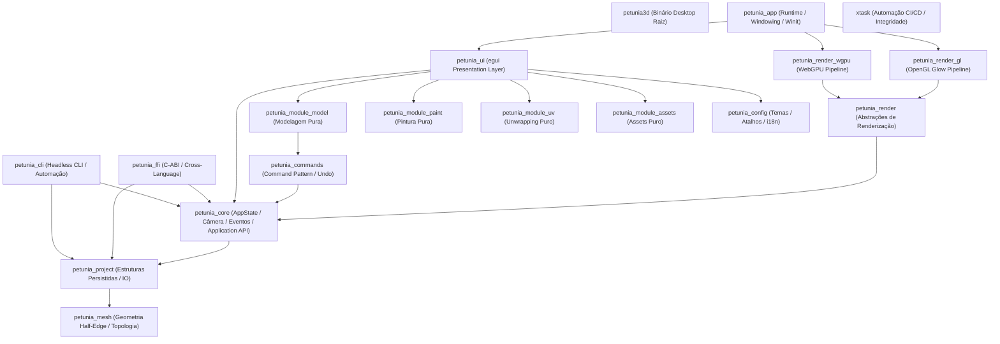

# Macroarquitetura de Crates

O Petunia3D é construído sob uma arquitetura modular estrita em Cargo Workspace. O workspace declara **19 membros** em `Cargo.toml`:

`core`, `mesh`, `commands`, `config`, `project`, `plugins`, `mcp`, `render`, `render-gl`, `render-wgpu`, `module-model`, `module-paint`, `module-uv`, `module-assets`, `ui`, `app`, `cli`, `ffi`, `xtask`.

> A autoridade sobre o grafo de crates, fronteiras e ownership é o capítulo 28 do Livro Vivo, com o capítulo 34 para representação/ownership/Rust safety:
> [28 — Arquitetura Rust, Cargo Workspace e Fronteiras entre Crates](/bible/foundations/28-arquitetura-rust-cargo-crates) e
> [34 — Arquitetura Modular Explícita, Rust Safety e Representação em Código](/bible/foundations/34-arquitetura-modular-rust-safety).
>
> Contagens antigas (13, 14, 17) nesta documentação estavam desatualizadas — o número válido é o do `Cargo.toml`.

## Descrição dos Crates

| Crate | Responsabilidade |
| :--- | :--- |
| `crates/mesh` | Estruturas de dados geométricas fundamentais, representação de vértices, arestas e faces poligonais. |
| `crates/project` | Formato persistente de projeto (`.petunia`), gerenciador de coleções, anotações e medidas. |
| `crates/core` | O coração de estado em tempo de execução: `AppState`, matemática de câmera orbital, barramento de eventos, operações modais e Application API (DTOs). |
| `crates/commands` | Pilha transacional de comandos atômicos (`execute`, `undo`, `redo`). |
| `crates/config` | Carregador de temas visuais, keymaps configuráveis e dicionários de tradução TOML. |
| `crates/render` | Traits e contratos agnósticos para os renderizadores gráficos. |
| `crates/render-wgpu` | Backend gráfico primário construído com `wgpu` e shaders WGSL modernos. |
| `crates/render-gl` | Backend de compatibilidade universal construído com `glow` (OpenGL ES 3.0 / Desktop OpenGL 3.3). |
| `crates/ui` | Toda a interface gráfica, layout de painéis, gizmos 3D, ícones vetoriais e controles com `egui`. |
| `crates/app` | Orquestração da janela desktop, loop de eventos do `winit` e inicialização de contexto gráfico. |
| `crates/cli` | Utilitário de linha de comando autônomo e 100% headless para automação, pipelines e conversão de arquivos. |
| `crates/ffi` | Camada de interoperabilidade C-ABI (`cdylib` / `rlib`) e header canônico C/C++ (`include/petunia.h`) para frontends externos. |
| `crates/xtask` | Ferramenta interna de automação, CI/CD, prevenção de drift documental (`docs-check`) e validação arquitetural (`arch-check`). |
| `src/main.rs` | Ponto de entrada do executável desktop `petunia3d`, unindo o runtime `petunia_app` com renderizadores gráficos. |

