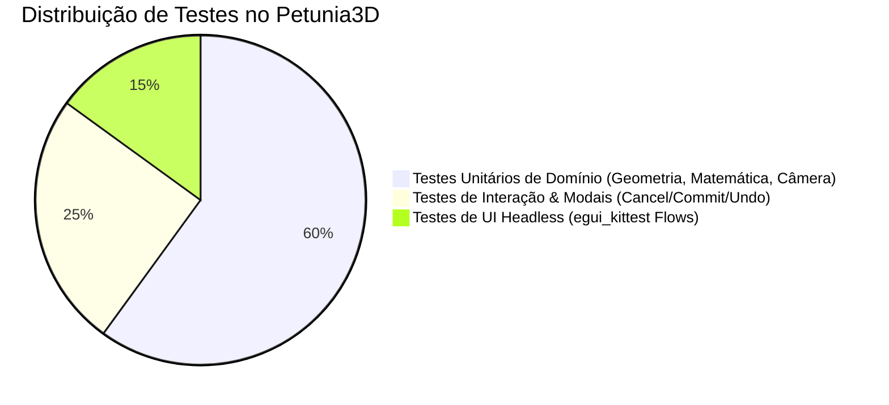

# Estratégia de Testes

O Petunia3D adota uma disciplina rigorosa de **Test-Driven Development (TDD)** e pirâmide de testes completa para garantir regressão zero.

---

## Pirâmide de Qualidade



## Categorias de Testes

1. **Testes Unitários de Domínio (`crates/core`, `crates/mesh`)**:
   - Matemática de projeção ortográfica e perspectiva da câmera orbital;
   - Picking determinístico com oclusão e cálculo exato de raios;
   - Topologia de cortes, subdivisões e cálculos de normais;
   - Preservação do histórico e consistência de travamento de eixos (`locked_axes`).

2. **Testes de Interação e Modais (`crates/ui/src/*_tests.rs`)**:
   - Injeção de eventos sintéticos de teclado e mouse simulando o usuário real;
   - Validação de que pressionar `Escape` restaura 100% dos bytes da geometria original;
   - Validação de que entrada numérica direta constrói a matriz de transformação exata.

3. **Testes de Fluxos de Interface Headless (`crates/ui/tests/kittest_ui_flows.rs`)**:
   - Execução headless completa com `egui_kittest`, testando renderização de árvore do Outliner, abertura de menus, clique em botões da Viewport Bar e seleção de abas.

## Comandos para Executar os Testes

```bash
# Executar todos os testes do workspace
cargo test --workspace

# Executar apenas testes de interface
cargo test -p petunia_ui

# Executar testes com detecção de memory leaks via Miri (em crates seguros)
cargo test -p petunia_mesh
```
