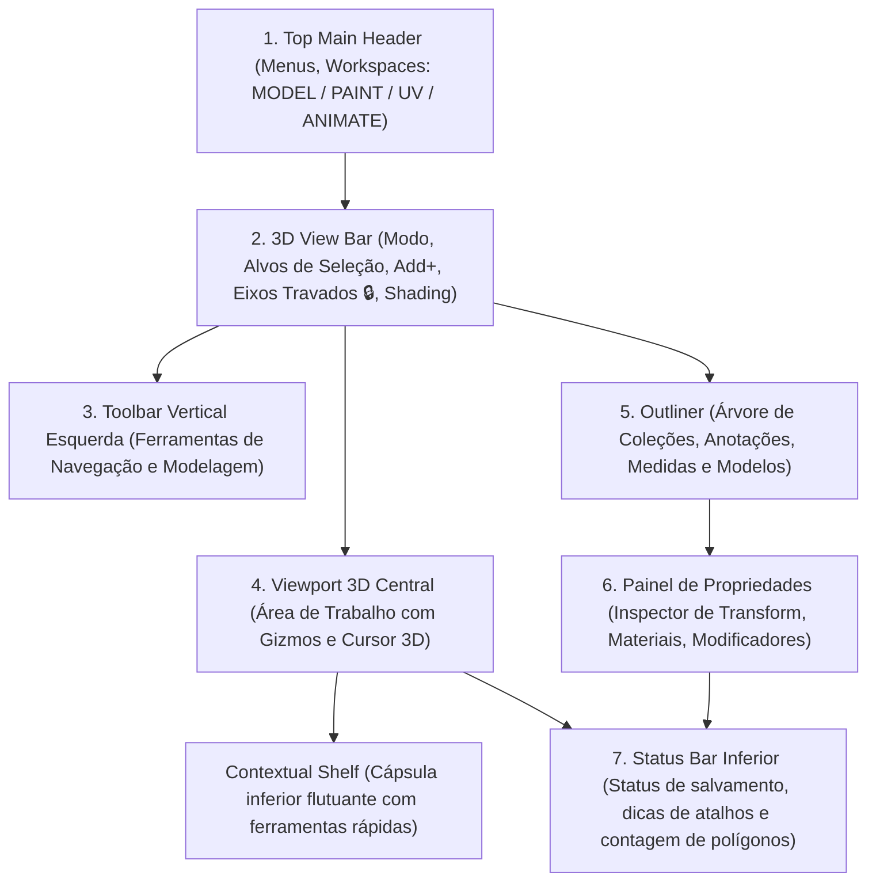

# Tour da Interface

A interface do **Petunia3D** é projetada sob uma arquitetura de seis blocos principais, organizada para eliminar sobreposições visuais e reduzir a carga cognitiva durante a modelagem.

## Os Blocos Principais

### 1. Top Main Header (Barra de Menus e Workspaces)
Localizada no topo absoluto da tela:
- **Menus do Sistema**: `Arquivo` (Novo, Abrir, Salvar, Exportar), `Editar` (Desfazer, Refazer, Configurações), `Janela` e `Ajuda`.
- **Pills de Workspace**: Alternadores rápidos entre os ambientes especializados: `MODEL`, `PAINT`, `UV` e `ANIMATE`.

### 2. 3D View Bar (Barra de Controle da Viewport)
A barra horizontal logo acima da área de visualização tridimensional:
- **Seletor de Modo**: Alterna entre `Modo Objeto` e `Modo de Edição`;
- **Alvos de Seleção**: Ativos apenas em modo de edição: `⬝ Vértice (1)`, `╱ Aresta (2)` e `▨ Face (3)`;
- **Menu Adicionar (`➕ Add+ ▾`)**: Adição de cubos, esferas, cilindros, planos ou imagens de referência;
- **Travamento de Eixos (`🔒 [ X ] [ Y ] [ Z ]`)**: Botões interativos para restringir movimentos a eixos específicos com feedback de cores;
- **Esferas de Shading**: Seletores de modo de visualização: `○ Wireframe`, `● Solid`, `◐ Material Preview`, `☼ Rendered`.

### 3. Toolbar Vertical Esquerda
Contém os ícones das ferramentas essenciais com traço proeminente e cores vivas:
- Seleção, Mover, Rotacionar, Escalar, Transformação Combinada, Régua de Medição e Lápis de Anotação.
- Ao entrar em Modo de Edição, expande automaticamente com as ferramentas de modelagem de malha.

### 4. Viewport 3D Central
A área gráfica onde o modelo é exibido e manipulado:
- Suporta órbita suave (`MMB` ou `Alt+LMB`), pan (`Shift+MMB`) e zoom (`Scroll`);
- Exibe o 3D Cursor, eixos cartesianos no chão (grid) e linhas-guia 3D ao travar eixos.

### 5. Outliner (Árvore de Cena)
Localizado no topo da barra lateral direita:
- Exibe coleções estruturadas, modelos, anotações e medidas;
- Fornece controles de visibilidade (`👁`), bloqueio (`🔒`) e isolamento de modelo (`⌖ Isolar`).

### 6. Painel de Propriedades
Localizado logo abaixo do Outliner:
- Abas temáticas coloridas (`Ferramenta`, `Objeto`, `Modificadores`, `Dados da Malha`, `Material`);
- Exibe coordenadas exatas de Transformação (Posição X/Y/Z, Rotação X/Y/Z, Escala X/Y/Z).

### 7. Barra de Status Inferior
Na base da tela:
- Indicador de projeto salvo (`● Salvo` / `○ Não salvo`);
- Mensagens de ajuda contextual com dicas de atalhos em tempo real;
- Telemetria de desempenho e contagem geométrica: contagem de triângulos (`Tris`), vértices (`Verts`) e taxa de quadros (`ms`).
