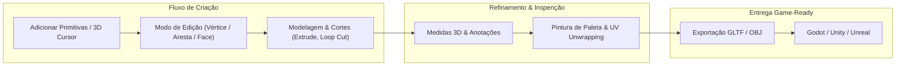

## Conheça o Petunia3D

O **Petunia3D** foi projetado para artistas 3D, desenvolvedores de jogos indie e criadores de protótipos rápidos que buscam a agilidade e elegância dos atalhos clássicos do Blender sem o peso de um pacote de produção hipercomplexo.

### 💡 Começando em 3 passos simples
1. Baixe ou compile o binário único: `cargo run --release`
2. Siga o tutorial de 15 minutos em [Seu Primeiro Modelo](/getting-started/your-first-model)
3. Conheça os atalhos canônicos no [Cheatsheet de Teclado](/shortcuts/cheatsheet)

