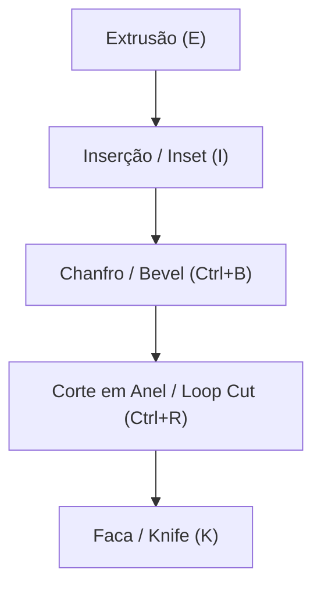

# Fluxo de Modelagem

O Petunia3D adota uma filosofia **Shape-First**: você começa com volumes e proporções sólidas bem definidas e adiciona detalhes através de cortes e extrusões atômicas.

---

## 1. Operações Modais

As transformações básicas no Petunia3D operam no paradigma *modal*:
1. Você aciona o comando por uma tecla de atalho (`G` para mover, `R` para rotacionar, `S` para escalar);
2. O cursor entra no modo de transformação e exibe o HUD flutuante com os valores em tempo real;
3. Opcionalmente, você digita um valor numérico exato no teclado (ex: digitar `2.5` e pressionar `Enter`);
4. Para confirmar, clique com o botão esquerdo (`LMB`) ou pressione `Enter`;
5. Para cancelar, clique com o botão direito (`RMB`) ou pressione `Escape` — o modelo retorna instantaneamente ao estado original.

---

## 2. Ferramentas Primárias de Modelagem

- **Extrusão (`E`)**: Duplica os elementos selecionados e os projeta ao longo da normal da face ou de um eixo travado.
- **Inserção / Inset (`I`)**: Cria um anel de novas faces recuadas dentro da face selecionada, ideal para criar molduras e painéis.
- **Chanfro / Bevel (`Ctrl+B`)**: Arredonda ou suaviza quinas e arestas vivas.
- **Corte em Anel / Loop Cut (`Ctrl+R`)**: Insere um anel de arestas contínuo através de faces quadrangulares com deslizamento interativo.
- **Faca / Knife (`K`)**: Permite desenhar cortes livres conectando vértices e arestas com precisão de clique a clique.
- **Push / Pull**: Empurra ou puxa a geometria selecionada mantendo a planaridade adjacente.

---

## 3. Sistema de Undo / Redo Transacional

- **Desfazer**: `Ctrl+Z`
- **Refazer**: `Ctrl+Shift+Z` ou `Ctrl+Y`

Cada checkpoint é gravado de forma atômica. Cancelamentos com `Esc` durante qualquer operação jamais poluem a pilha de histórico.
