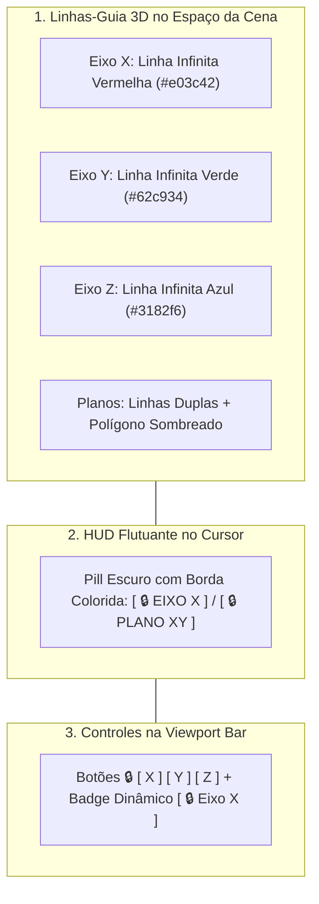

# Viewport 3D & Câmera

O **Viewport 3D** é o coração da experiência interativa do Petunia3D. Ele combina renderização acelerada por GPU, navegação orbital suave e um sistema de feedback em três camadas para transformações geométricas.

---

## 1. Navegação da Câmera

| Ação de Navegação | Mouse | Atalho Alternativo |
| :--- | :--- | :--- |
| **Órbita 3D** | Clique e arraste com o botão do meio (`MMB`) | `Alt + LMB` |
| **Panorâmica (Pan)** | Segure `Shift` + clique e arraste com `MMB` | `Shift + Alt + LMB` |
| **Zoom** | Roda de rolagem (`Scroll`) | `Ctrl + MMB` |
| **Enquadrar Seleção** | `Numpad .` (Ponto no teclado numérico) | Tecla `.` |
| **Vistas Ortográficas** | `Numpad 1` (Frontal), `Numpad 3` (Direita), `Numpad 7` (Superior) | Botões no Gizmo de Navegação |
| **Alternar Perspectiva / Ortográfica** | `Numpad 5` | Ícone de grade no Gizmo de Navegação |

---

## 2. Indicação Visual de Travamento de Eixos & Planos 🔒

Durante qualquer atividade de edição (como Mover `G`, Rotacionar `R`, Escalar `S` ou arrastar eixos de gizmos), você pode restringir o movimento a um eixo cartesiano ou plano coordenado. O Petunia3D fornece **feedback imediato em três camadas visuais coordenadas**:

### Como Ativar e Alternar:
- Pressione `X`, `Y` ou `Z` para travar o movimento no respectivo eixo cartesiano;
- Pressione `Shift+X` (Plano YZ), `Shift+Y` (Plano XZ) ou `Shift+Z` (Plano XY) para travar a transformação no plano perpendicular;
- Pressione a mesma tecla novamente para destravar e retornar à movimentação livre (`[ 🔓 LIVRE ]`);
- Você também pode clicar diretamente nos botões `[ X ]`, `[ Y ]`, `[ Z ]` na barra da viewport para travar ou pré-configurar os eixos antes de iniciar uma edição.

---

## 3. Modos de Sombreamento (Viewport Shading)

Quatro esferas de visualização compactas estilo Blender estão disponíveis no canto superior direito da Viewport Bar:
1. **○ Wireframe (`Shift+Z`)**: Renderiza exclusivamente as arestas e vértices poligonais sem preenchimento de faces. Ideal para selecionar componentes internos.
2. **● Solid (`Alt+Z`)**: Sombreamento padrão opaco com iluminação direcional difusa.
3. **◐ Material Preview**: Exibe as cores de materiais e texturas atribuídas aos polígonos.
4. **☼ Rendered**: Pré-visualização final com reflexos de iluminação avançada.

---

## 4. Modo Raio-X (X-Ray)

Pressione `Alt+Z` para ativar ou desativar o **Modo Raio-X**:
- As faces se tornam semitransparentes (`alpha ~ 0.45`), permitindo enxergar a geometria traseira;
- O algoritmo de picking passa a permitir selecionar vértices e arestas que estejam ocluídos atrás de superfícies sólidas.

---

## 5. O 3D Cursor

O cursor tridimensional é representado por uma mira circular vermelha e branca:
- **Posicionamento**: Segure `Shift` e clique com o botão direito (`Shift + RMB`) em qualquer ponto da malha ou do grid;
- **Utilidade**: Novas primitivas geométricas adicionadas à cena são geradas exatamente na coordenada do 3D Cursor.
- **Redefinição**: Pressione `Shift+C` para centralizar o cursor 3D de volta na origem `(0, 0, 0)`.
